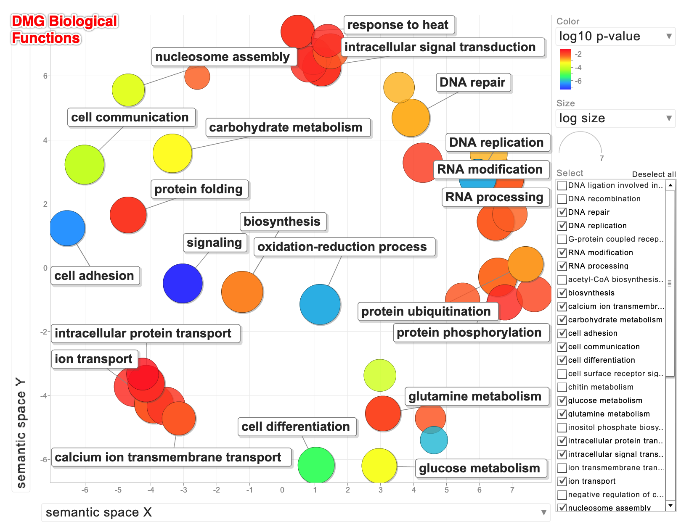

In this notebook I identify differentially methylated genes (DMGs) between two Olympia oyster populations, Hood Canal and South Sound. First I prepare my data to be in the correct format / shape, then test for DMGs using a binomial GLM. The genes are also annotated using a gene feature file and BEDtools, and biological functions associated with GO terms are visualized with [REVIGO](http://revigo.irb.hr/). 

```{r setup, include=FALSE}
knitr::opts_chunk$set(echo = TRUE)
```

### Load libraries 

```{r, message=FALSE, warning=FALSE, results=FALSE}
list.of.packages <- c("tidyverse", "reshape2","dplyr", "tidyr", "readr", "stringr", "plotly", "car", "Pstat") #add new libraries here 
new.packages <- list.of.packages[!(list.of.packages %in% installed.packages()[,"Package"])]
if(length(new.packages)) install.packages(new.packages)

# Load all libraries 
lapply(list.of.packages, FUN = function(X) {
  do.call("require", list(X)) 
})
```

### Load filtered methylation data object with sample info which was created in the notebook "01-methylkit" 

```{r}
load(here::here("analyses", "methylation-filtered", "R-objects", "meth_filter_reshaped")) 
head(meth_filter_reshaped) 
```

### Use bedtools `slop` to include 2kb regions on either side of gene regions 

I want to identify methylated loci that are within genes but also 2kb upstream and downstream of gene regions. Therefore, before intersecting methylated loci with genes, I need to create a gene region +/- 2kb file. I will do this using `slopBed`.

First, generate a "genome file", which defines size of each chromosome. This is so the `slop` function restricts results to within a contig. I can use the indexed FASTA file that I created for a blast. 

Extract column 1 (contig name) and column 2 (# bases in the contig)

```{bash}
head -n 2 "../resources/Olurida_v081.fa.fai"
cut -f 1,2 "../resources/Olurida_v081.fa.fai" > "../resources/Olurida_chrom.sizes"
head -n 2 "../resources/Olurida_chrom.sizes"
```

### Run slopBed with gene feature file 

```{bash}
head -n 4 "../genome-features/Olurida_v081-20190709.gene.gff"
```

```{bash}
slopBed \
-i "../genome-features/Olurida_v081-20190709.gene.gff" \
-g "../resources/Olurida_chrom.sizes" \
-b 2000 \
> "../genome-features/Olurida_v081-20190709.gene.2kbslop.gff"
head -n 3 "../genome-features/Olurida_v081-20190709.gene.2kbslop.gff"
```

### Use intersectBed to find where loci and genes intersect, allowing loci to be mapped to annotated genes
  
  wb: Print all lines in the second file
  a: input data file, which was created in previous code chunk
  b: save annotated gene list

```{bash}
intersectBed \
  -wb \
  -a "../analyses/methylation-filtered/meth_filter_long.tab" \
  -b "../genome-features/Olurida_v081-20190709.gene.2kbslop.gff" \
  > "../analyses/methylation-filtered/meth_filter_gene.2kbslop.tab"
```

### Here is the number of loci associated with gene regions +/- 2kb: 

```{bash}
wc -l "../analyses/methylation-filtered/meth_filter_gene.2kbslop.tab"
```

### Check out format of resulting gene regions 

```{bash}
head -n 2  "../analyses/methylation-filtered/meth_filter_gene.2kbslop.tab"
```

### Now run intersectBed to NOT include the 2kb flanks  

Return the number of loci associated with gene regions. Not sure if this will be used, but it's good to save it just in case. 

```{bash}
intersectBed \
  -wb \
  -a "../analyses/methylation-filtered/meth_filter_long.tab" \
  -b "../genome-features/Olurida_v081-20190709.gene.gff" \
  > "../analyses/methylation-filtered/meth_filter_gene.tab"
wc -l "../analyses/methylation-filtered/meth_filter_gene.tab"
```

### Check out resulting files which contain methylated loci that are within gene regions (+/- 2kb), and gene bodies: 

```{bash}
head -n 3 "../analyses/methylation-filtered/meth_filter_gene.2kbslop.tab"
```

```{bash}
head -n 1 "../analyses/methylation-filtered/meth_filter_gene.tab"
```

### Binomial GLMs to test for differentially methylated genes regions. 

#### Add columns for organization / filtering: 
-- gene = contig number + start/end locus  
-- group = sample number + gene  
-- population = HC for Hood Canal, or SS for South Sound  

```{r}
meth_filter_genes_2kbslop <- 
  read_delim(file = here::here("analyses", "methylation-filtered", "meth_filter_gene.2kbslop.tab"), delim = "\t", col_names = c(colnames(meth_filter_reshaped[-10]), "population", "contig_gene", "source_gene", "feature_gene", "start_gene_2kb", "end_gene_2kb", "unknown1_gene", "strand_gene", "unknown2_gene", "notes_gene")) %>%
  mutate(gene=paste(contig_gene, start_gene_2kb, end_gene_2kb, sep="_")) %>%
  mutate(group=paste(sample, gene, sep="_")) 
```

### Here is the number of genes that are represented in our methylation data set: 

```{r}
length(unique(meth_filter_genes_2kbslop$gene)) 
```

### Filter for genes with **at minimum 5 methylated loci**

```{r}
min.filt_2kbslop <- dplyr::count(meth_filter_genes_2kbslop, vars = c(group))
newdata <- min.filt_2kbslop[which(min.filt_2kbslop$n > 4), ]
sub_meth_table_2kbslop <- meth_filter_genes_2kbslop[meth_filter_genes_2kbslop$group %in% newdata$vars,]
save(sub_meth_table_2kbslop, file="../analyses/DMGs/R-objects/sub_meth_table_2kbslop")
```

```{r}
head(sub_meth_table_2kbslop)
```

### Here is the number of genes that remain after filtering for those with 5 or more methylated loci within each gene region:

```{r}
length(unique(sub_meth_table_2kbslop$gene))  
```

### Run GLM to test for differences among population for each gene individually 
Note: this script was created by Hollie Putnam ([GM.Rmd](https://raw.githubusercontent.com/hputnam/Geoduck_Meth/master/RAnalysis/Scripts/GM.Rmd)); there are minor revisions below. I retained some commented out lines (notably-testing for position w/n gene, such as intron & exon) in case we want to include those as factors in the future. 

```{r}
# create data frame to stored results
results_2kbslop <- data.frame()

gs <- unique(sub_meth_table_2kbslop$gene)

#first subset the unique dataframes and second run the GLMs
for(i in 1:length(gs)){
  
  #subset the dataframe gene by gene
  sub_meth_table_2kbslop1 <- subset(sub_meth_table_2kbslop, gene ==gs[i])
  
  # fit glm position model
  fit <- glm(matrix(c(numCs, numTs), ncol=2) ~ as.factor(population) + (1|sample), 
             data=sub_meth_table_2kbslop1, family=binomial)
  a <- anova(fit, test="Chisq")
  
  # capture summary stats to data frame
  df <- data.frame(sub_meth_table_2kbslop1[c("population", "sample", "contig_gene", "start_gene_2kb", "end_gene_2kb", "gene", "chr", "start", "sample", "coverage", "numCs", "numTs", "percMeth", "notes_gene")],
                   pval.treatment = a$`Pr(>Chi)`[2],
                   #pval.position = a$`Pr(>Chi)`[3], #uncomment if you want to include position of CpG within a gene
                   #pval.treatment_x_position = a$`Pr(>Chi)`[4], #uncomment if you want to include position of CpG within a gene interaction with treatment
                   stringsAsFactors = F)
  
  # bind rows of temporary data frame to the results data frame
  results_2kbslop <- rbind(results_2kbslop, df)
  
}
results_2kbslop[is.na(results_2kbslop)] <- 0
results_2kbslop$adj.pval.pop <- p.adjust(results_2kbslop$pval.treatment, method='BH')
#results_2kbslop$adj.pval.position <- p.adjust(results_2kbslop$pval.position, method='BH') #uncomment if you want to include position of CpG within a gene
#results_2kbslop$adj.pval.treatment_x_position <- p.adjust(results_2kbslop$pval.treatment_x_position, method='BH') #uncomment if you want to include position of CpG within a gene interaction with treatment
```

### Extract only genes that were differentially methylated (p-adj < 0.05), 

```{r}
#save df with differentially methylated genes 
DMGs_2kbslop <- subset(results_2kbslop, adj.pval.pop < 0.05) #%>%
#  mutate(contig_gene_start=paste(contig_gene, start_gene_2kb, sep="_"))
save(DMGs_2kbslop, file="../analyses/DMGs/R-objects/DMGs_2kbslop")


DMGs_2kbslop.genes <- DMGs_2kbslop[!duplicated(DMGs_2kbslop$gene), c("contig_gene", "start_gene_2kb", "end_gene_2kb", "notes_gene", "pval.treatment", "adj.pval.pop")]

# Save .bed file for gene enrichment and visualization 
write_delim(DMGs_2kbslop.genes[,c("contig_gene", "start_gene_2kb", "end_gene_2kb")], "../analyses/DMGs/DMGs_2kbslop.bed",  delim = '\t', col_names = FALSE)

# Save .bed file for all genes included in DMG analysis 
write_delim(results_2kbslop[!duplicated(results_2kbslop$gene), c("contig_gene", "start_gene_2kb", "end_gene_2kb")], "../analyses/DMGs/AllGenes-DMGs_2kbslop.bed",  delim = '\t', col_names = FALSE)
```

### Here is the number of differentially methylated genes (5 loci per gene): 

```{r}
length(unique(DMGs_2kbslop$gene))  
```

### Extract GO terms for DMGs_2kbslop and save to file 

```{r}
# split gene data in "notes_gene" column into separate columns 
DMGs_2kbslop.genes <- DMGs_2kbslop.genes %>%
  mutate(ID=str_extract(notes_gene, "ID=(.*?);"),
       Parent=str_extract(notes_gene, "Parent=(.*?);"),
       Name=str_extract(notes_gene, "Name=(.*?);"),
       Alias=str_extract(notes_gene, "Alias=(.*?);"),
       AED=str_extract(notes_gene, "AED=(.*?);"),
       eAED=str_extract(notes_gene, "eAED=(.*?);"),
       Note=str_extract(notes_gene, "Note=(.*?);"),
       Ontology_term=str_extract(notes_gene, "Ontology_term=(.*?);"),
       Dbxref=str_extract(notes_gene, "Dbxref=(.*?);")
       )
write_csv(DMGs_2kbslop.genes, path = here::here("analyses", "DMGs", "DMGs_2kbslop.genes.csv"))

#Extract GO terms 
DMGs_2kbslop.genes.GO <- DMGs_2kbslop.genes %>%
  mutate(Ontology_term = str_replace(Ontology_term, pattern="Ontology_term=",replacement = "")) %>%
  mutate(Ontology_term = str_replace(Ontology_term, pattern=";",replacement = "")) %>%
  separate(Ontology_term, sep=",", into=paste("GO", 1:11, sep="_")) %>%
  pivot_longer(cols=c("GO_1","GO_2","GO_3","GO_4","GO_5","GO_6","GO_7","GO_8","GO_9","GO_10","GO_11"), names_to = "GO_number", values_to = "GO_term") %>%
  dplyr::select(-GO_number) %>%
  filter(!is.na(Note) & !is.na(GO_term))

write_delim(DMGs_2kbslop.genes.GO[,c("GO_term","adj.pval.pop")], path = here::here("analyses/", "DMGs/", "DMGs_2kbslop.GO.txt"), delim = '\t', col_names = F) #write out df with just GO terms and p-adj values 
```

The file "../analyses/DMGs/DMGs_2kbslop.GO.txt" was opened outside of RMarkdown and the GO terms and p-values were pasted into REVIGO. I then exported the R script to generate the Biological Processes scatterplot. Here is the REVIGO table: 

term_ID | description | frequency | plot_X | plot_Y | plot_size | log10 p-value | uniqueness | dispensability | representative | eliminated
-- | -- | -- | -- | -- | -- | -- | -- | -- | -- | --
GO:0006260 | DNA replication | 1.58% | 5.949 | 2.822 | 5.306 | -6.1605 | 0.719 | 0 | 6260 | 0
GO:0007155 | cell adhesion | 0.54% | -6.544 | 1.248 | 4.844 | -6.4135 | 0.914 | 0 | 7155 | 0
GO:0007156 | homophilic cell adhesion via plasma membrane adhesion molecules | 0.10% | null | null | 4.087 | -6.4135 | 0.914 | 0.85 | 7155 | 1
GO:0023052 | signaling | 6.77% | -3.032 | -0.496 | 5.939 | -7.3332 | 0.956 | 0 | 23052 | 0
GO:0070588 | calcium ion transmembrane transport | 0.16% | -3.153 | -4.713 | 4.305 | -2.1079 | 0.868 | 0 | 70588 | 0
GO:0009058 | biosynthetic process | 31.61% | -1.225 | -0.762 | 6.608 | -2.4968 | 0.943 | 0.026 | 9058 | 0
GO:0006334 | nucleosome assembly | 0.09% | -4.686 | 5.561 | 4.057 | -3.6686 | 0.881 | 0.029 | 6334 | 0
GO:0007264 | small GTPase mediated signal transduction | 0.49% | 1.48 | 6.771 | 4.794 | -2.1354 | 0.743 | 0.034 | 7264 | 0
GO:0006457 | protein folding | 0.90% | -4.69 | 1.661 | 5.064 | -1.7376 | 0.912 | 0.037 | 6457 | 0
GO:0007154 | cell communication | 7.22% | -6.016 | 3.233 | 5.967 | -4.0935 | 0.904 | 0.048 | 7154 | 0
GO:0005975 | carbohydrate metabolic process | 5.26% | -3.347 | 3.585 | 5.829 | -3.2718 | 0.888 | 0.081 | 5975 | 0
GO:0006030 | chitin metabolic process | 0.08% | 2.981 | -3.369 | 3.994 | -3.9452 | 0.855 | 0.103 | 6030 | 0
GO:0032958 | inositol phosphate biosynthetic process | 0.01% | 4.623 | -5.39 | 2.943 | -6.0631 | 0.827 | 0.121 | 32958 | 0
GO:0030154 | cell differentiation | 1.13% | 1.041 | -6.177 | 5.162 | -5.21 | 0.858 | 0.133 | 30154 | 0
GO:0016567 | protein ubiquitination | 0.52% | 7.405 | 0.126 | 4.827 | -2.6487 | 0.717 | 0.15 | 16567 | 0
GO:0016579 | protein deubiquitination | 0.20% | null | null | 4.398 | -1.8804 | 0.726 | 0.829 | 16567 | 1
GO:0006006 | glucose metabolic process | 0.43% | 2.958 | -6.194 | 4.741 | -3.4042 | 0.835 | 0.213 | 6006 | 0
GO:0055114 | oxidation-reduction process | 15.06% | 1.16 | -1.152 | 6.286 | -6.1605 | 0.859 | 0.214 | 55114 | 0
GO:0019427 | acetyl-CoA biosynthetic process from acetate | 0.03% | 4.516 | -4.71 | 3.604 | -2.0321 | 0.81 | 0.237 | 19427 | 0
GO:0006886 | intracellular protein transport | 1.20% | -4.141 | -3.625 | 5.187 | -1.5764 | 0.862 | 0.263 | 6886 | 0
GO:0009408 | response to heat | 0.17% | 0.479 | 7.378 | 4.328 | -1.7376 | 0.834 | 0.315 | 9408 | 0
GO:0006396 | RNA processing | 3.21% | 6.772 | 2.794 | 5.615 | -2.1891 | 0.746 | 0.319 | 6396 | 0
GO:0006511 | ubiquitin-dependent protein catabolic process | 0.58% | 7.678 | -0.832 | 4.874 | -1.8804 | 0.781 | 0.321 | 6511 | 0
GO:0006541 | glutamine metabolic process | 0.47% | 3.071 | -4.558 | 4.782 | -1.9271 | 0.785 | 0.33 | 6541 | 0
GO:0001522 | pseudouridine synthesis | 0.35% | 6.93 | 1.68 | 4.652 | -2.1891 | 0.709 | 0.384 | 1522 | 0
GO:0000154 | rRNA modification | 0.35% | null | null | 4.658 | -1.3136 | 0.678 | 0.701 | 1522 | 1
GO:0006811 | ion transport | 5.34% | -3.91 | -4.255 | 5.836 | -2.1079 | 0.866 | 0.389 | 6811 | 0
GO:0046600 | negative regulation of centriole replication | 0.00% | -2.59 | 5.971 | 2.477 | -2.1569 | 0.824 | 0.407 | 46600 | 0
GO:0006486 | protein glycosylation | 0.32% | 5.491 | -1.021 | 4.61 | -2.0586 | 0.675 | 0.429 | 6486 | 0
GO:0051103 | DNA ligation involved in DNA repair | 0.04% | 3.562 | 5.637 | 3.703 | -2.8009 | 0.703 | 0.454 | 51103 | 0
GO:0035023 | regulation of Rho protein signal transduction | 0.13% | 1.394 | 7.1 | 4.206 | -1.5602 | 0.764 | 0.515 | 35023 | 0
GO:0055085 | transmembrane transport | 8.92% | -4.515 | -3.723 | 6.058 | -1.5468 | 0.863 | 0.535 | 55085 | 0
GO:0006355 | regulation of transcription, DNA-templated | 9.92% | 4.282 | 3.292 | 6.105 | -1.7475 | 0.633 | 0.537 | 6355 | 0
GO:0006468 | protein phosphorylation | 4.14% | 6.56 | -0.302 | 5.725 | -2.3389 | 0.67 | 0.56 | 6468 | 0
GO:0034220 | ion transmembrane transport | 3.53% | -3.536 | -4.332 | 5.656 | -1.6655 | 0.846 | 0.566 | 34220 | 0
GO:0006470 | protein dephosphorylation | 0.59% | 6.774 | -1.091 | 4.875 | -1.5439 | 0.715 | 0.568 | 6470 | 0
GO:0009451 | RNA modification | 1.78% | 6.493 | 1.45 | 5.358 | -2.1891 | 0.686 | 0.581 | 9451 | 0
GO:0015914 | phospholipid transport | 0.08% | -4.251 | -3.327 | 3.987 | -1.3062 | 0.821 | 0.584 | 15914 | 0
GO:0035556 | intracellular signal transduction | 4.00% | 1.211 | 6.286 | 5.71 | -1.705 | 0.704 | 0.593 | 35556 | 0
GO:0007186 | G-protein coupled receptor signaling pathway | 0.88% | 0.818 | 6.368 | 5.054 | -1.6167 | 0.736 | 0.638 | 7186 | 0
GO:0007166 | cell surface receptor signaling pathway | 0.92% | 0.957 | 6.609 | 5.072 | -1.4923 | 0.735 | 0.641 | 7166 | 0
GO:0006281 | DNA repair | 2.23% | 3.916 | 4.695 | 5.457 | -2.8009 | 0.608 | 0.684 | 6281 | 0
GO:0006310 | DNA recombination | 1.64% | 6.285 | 3.557 | 5.323 | -2.8009 | 0.732 | 0.688 | 6310 | 0


### Here is a screen shot of the REVIGO plot showing GO terms associated with DMGs_2kbslop (5 methylated loci per gene) 

 

### Here is a script to re-create that REVIGO plot  

```{r, message=FALSE, warning=FALSE}
# A plotting R script produced by the REVIGO server at http://revigo.irb.hr/
# If you found REVIGO useful in your work, please cite the following reference:
# Supek F et al. "REVIGO summarizes and visualizes long lists of Gene Ontology
# terms" PLoS ONE 2011. doi:10.1371/journal.pone.0021800


# --------------------------------------------------------------------------
# If you don't have the ggplot2 package installed, uncomment the following line:
# install.packages( "ggplot2" );
library( ggplot2 );
# --------------------------------------------------------------------------
# If you don't have the scales package installed, uncomment the following line:
# install.packages( "scales" );
library( scales );


# --------------------------------------------------------------------------
# Here is your data from REVIGO. Scroll down for plot configuration options.

revigo.names <- c("term_ID","description","frequency_%","plot_X","plot_Y","plot_size","log10_p_value","uniqueness","dispensability");
revigo.data <- rbind(c("GO:0006260","DNA replication", 1.577, 5.949, 2.822, 5.306,-6.1605,0.719,0.000),
c("GO:0007155","cell adhesion", 0.544,-6.544, 1.248, 4.844,-6.4135,0.914,0.000),
c("GO:0023052","signaling", 6.765,-3.032,-0.496, 5.939,-7.3332,0.956,0.000),
c("GO:0070588","calcium ion transmembrane transport", 0.157,-3.153,-4.713, 4.305,-2.1079,0.868,0.000),
c("GO:0009058","biosynthetic process",31.611,-1.225,-0.762, 6.608,-2.4968,0.943,0.026),
c("GO:0006334","nucleosome assembly", 0.089,-4.686, 5.561, 4.057,-3.6686,0.881,0.029),
c("GO:0007264","small GTPase mediated signal transduction", 0.485, 1.480, 6.771, 4.794,-2.1354,0.743,0.034),
c("GO:0006457","protein folding", 0.903,-4.690, 1.661, 5.064,-1.7376,0.912,0.037),
c("GO:0007154","cell communication", 7.219,-6.016, 3.233, 5.967,-4.0935,0.904,0.048),
c("GO:0005975","carbohydrate metabolic process", 5.260,-3.347, 3.585, 5.829,-3.2718,0.888,0.081),
c("GO:0006030","chitin metabolic process", 0.077, 2.981,-3.369, 3.994,-3.9452,0.855,0.103),
c("GO:0032958","inositol phosphate biosynthetic process", 0.007, 4.623,-5.390, 2.943,-6.0631,0.827,0.121),
c("GO:0030154","cell differentiation", 1.133, 1.041,-6.177, 5.162,-5.2100,0.858,0.133),
c("GO:0016567","protein ubiquitination", 0.523, 7.405, 0.126, 4.827,-2.6487,0.717,0.150),
c("GO:0006006","glucose metabolic process", 0.430, 2.958,-6.194, 4.741,-3.4042,0.835,0.213),
c("GO:0055114","oxidation-reduction process",15.060, 1.160,-1.152, 6.286,-6.1605,0.859,0.214),
c("GO:0019427","acetyl-CoA biosynthetic process from acetate", 0.031, 4.516,-4.710, 3.604,-2.0321,0.810,0.237),
c("GO:0006886","intracellular protein transport", 1.199,-4.141,-3.625, 5.187,-1.5764,0.862,0.263),
c("GO:0009408","response to heat", 0.166, 0.479, 7.378, 4.328,-1.7376,0.834,0.315),
c("GO:0006396","RNA processing", 3.210, 6.772, 2.794, 5.615,-2.1891,0.746,0.319),
c("GO:0006511","ubiquitin-dependent protein catabolic process", 0.584, 7.678,-0.832, 4.874,-1.8804,0.781,0.321),
c("GO:0006541","glutamine metabolic process", 0.472, 3.071,-4.558, 4.782,-1.9271,0.785,0.330),
c("GO:0001522","pseudouridine synthesis", 0.350, 6.930, 1.680, 4.652,-2.1891,0.709,0.384),
c("GO:0006811","ion transport", 5.344,-3.910,-4.255, 5.836,-2.1079,0.866,0.389),
c("GO:0046600","negative regulation of centriole replication", 0.002,-2.590, 5.971, 2.477,-2.1569,0.824,0.407),
c("GO:0006486","protein glycosylation", 0.317, 5.491,-1.021, 4.610,-2.0586,0.675,0.429),
c("GO:0051103","DNA ligation involved in DNA repair", 0.039, 3.562, 5.637, 3.703,-2.8009,0.703,0.454),
c("GO:0035023","regulation of Rho protein signal transduction", 0.125, 1.394, 7.100, 4.206,-1.5602,0.764,0.515),
c("GO:0055085","transmembrane transport", 8.916,-4.515,-3.723, 6.058,-1.5468,0.863,0.535),
c("GO:0006355","regulation of transcription, DNA-templated", 9.917, 4.282, 3.292, 6.105,-1.7475,0.633,0.537),
c("GO:0006468","protein phosphorylation", 4.137, 6.560,-0.302, 5.725,-2.3389,0.670,0.560),
c("GO:0034220","ion transmembrane transport", 3.528,-3.536,-4.332, 5.656,-1.6655,0.846,0.566),
c("GO:0006470","protein dephosphorylation", 0.585, 6.774,-1.091, 4.875,-1.5439,0.715,0.568),
c("GO:0009451","RNA modification", 1.778, 6.493, 1.450, 5.358,-2.1891,0.686,0.581),
c("GO:0015914","phospholipid transport", 0.076,-4.251,-3.327, 3.987,-1.3062,0.821,0.584),
c("GO:0035556","intracellular signal transduction", 4.000, 1.211, 6.286, 5.710,-1.7050,0.704,0.593),
c("GO:0007186","G-protein coupled receptor signaling pathway", 0.882, 0.818, 6.368, 5.054,-1.6167,0.736,0.638),
c("GO:0007166","cell surface receptor signaling pathway", 0.920, 0.957, 6.609, 5.072,-1.4923,0.735,0.641),
c("GO:0006281","DNA repair", 2.234, 3.916, 4.695, 5.457,-2.8009,0.608,0.684),
c("GO:0006310","DNA recombination", 1.641, 6.285, 3.557, 5.323,-2.8009,0.732,0.688));

one.data <- data.frame(revigo.data);
names(one.data) <- revigo.names;
one.data <- one.data [(one.data$plot_X != "null" & one.data$plot_Y != "null"), ];
one.data$plot_X <- as.numeric( as.character(one.data$plot_X) );
one.data$plot_Y <- as.numeric( as.character(one.data$plot_Y) );
one.data$plot_size <- as.numeric( as.character(one.data$plot_size) );
one.data$log10_p_value <- as.numeric( as.character(one.data$log10_p_value) );
one.data$frequency <- as.numeric( as.character(one.data$frequency) );
one.data$uniqueness <- as.numeric( as.character(one.data$uniqueness) );
one.data$dispensability <- as.numeric( as.character(one.data$dispensability) );
#head(one.data);


# --------------------------------------------------------------------------
# Names of the axes, sizes of the numbers and letters, names of the columns,
# etc. can be changed below

p1 <- ggplot( data = one.data );
p1 <- p1 + geom_point( aes( plot_X, plot_Y, colour = log10_p_value, size = plot_size), alpha = I(0.6) ) + scale_size_area();
p1 <- p1 + scale_colour_gradientn( colours = c("blue", "green", "yellow", "red"), limits = c( min(one.data$log10_p_value), 0) );
p1 <- p1 + geom_point( aes(plot_X, plot_Y, size = plot_size), shape = 21, fill = "transparent", colour = I (alpha ("black", 0.6) )) + scale_size_area();
p1 <- p1 + scale_size( range=c(5, 30)) + theme_bw(); # + scale_fill_gradientn(colours = heat_hcl(7), limits = c(-300, 0) );
#ex <- one.data [ one.data$dispensability < 0.15, ]; 
p1 <- p1 + geom_text( data = one.data, aes(plot_X, plot_Y, label = description), colour = I(alpha("black", 0.85)), size = 3 );
p1 <- p1 + labs (y = "semantic space x", x = "semantic space y");
p1 <- p1 + theme(legend.key = element_blank()) ;
one.x_range = max(one.data$plot_X) - min(one.data$plot_X);
one.y_range = max(one.data$plot_Y) - min(one.data$plot_Y);
p1 <- p1 + xlim(min(one.data$plot_X)-one.x_range/10,max(one.data$plot_X)+one.x_range/10);
p1 <- p1 + ylim(min(one.data$plot_Y)-one.y_range/10,max(one.data$plot_Y)+one.y_range/10);

# --------------------------------------------------------------------------
# Output the plot to screen

p1;
```

### IGV 

Create bed files to visualze as a track of DMGs_2kbslop in IGV 

```{r}
DMGs_2kbslop.bed <- meth_filter_genes_2kbslop %>%
  filter(contig_gene %in% DMGs_2kbslop.genes$contig_gene & 
           start_gene_2kb %in% DMGs_2kbslop.genes$start_gene & 
           end_gene_2kb %in% DMGs_2kbslop.genes$end_gene) %>%
  dplyr::select(contig_gene, start_gene_2kb, end_gene_2kb, 
                unknown1_gene, strand_gene, unknown2_gene, notes_gene) %>%
  distinct(contig_gene, start_gene_2kb, end_gene_2kb)
#DMGs_2kbslop.bed <- DMGs_2kbslop.bed[!duplicated(test$contig_gene),]
readr::write_delim(DMGs_2kbslop.bed, "../analyses/DMGs/DMGs_2kbslop.bed",  delim = '\t', col_names = FALSE)
```

### Barplots showing % methylation of all methylated genes by population 
NOTE: this code is commented out as it's not needed and prints too many bar plots 

```{r}
# ggplotly(meth_filter_genes_2kbslop %>%
#   filter(contig_gene %in% DMGs_2kbslop.genes$contig_gene & 
#            start_gene %in% DMGs_2kbslop.genes$start_gene & 
#            end_gene %in% DMGs_2kbslop.genes$end_gene) %>% 
#   group_by(population, gene) %>%
#   summarise(allCs_percent = 100*(sum(numCs)/sum(coverage)), 
#             mean_percentMeth = mean(percMeth)) %>%
#   ggplot(aes(x = population, y = mean_percentMeth, fill = population)) + geom_bar(stat="identity") + facet_wrap(~gene) + theme_light() + scale_fill_manual(values=c("firebrick3","dodgerblue3")))
# 
# #checking to make sure numCs + numTs = coverage; should be 1:1 line 
# plot(meth_filter_genes_2kbslop$numCs + meth_filter_genes_2kbslop$numTs ~ meth_filter_genes_2kbslop$coverage)  
# 
# ## Look at coverage for each DMG by population (mean % methylation across samples)
# ggplotly(meth_filter_genes_2kbslop %>%
#   filter(contig_gene %in% DMGs_2kbslop.genes$contig_gene & 
#            start_gene %in% DMGs_2kbslop.genes$start_gene & 
#            end_gene %in% DMGs_2kbslop.genes$end_gene) %>% 
#   group_by(population, gene) %>%
#   summarise(sum_cov = sum(coverage), 
#             mean_cov = mean(coverage)) %>%
#   ggplot(aes(x = population, y = mean_cov, fill = population)) + 
#     geom_bar(stat="identity") + 
#     facet_wrap(~gene) + theme_light() + scale_fill_manual(values=c("firebrick3","dodgerblue3")))
# 
# DMG_counts <- meth_filter_genes_2kbslop %>%
#   filter(contig_gene %in% DMGs_2kbslop.genes$contig_gene & 
#            start_gene %in% DMGs_2kbslop.genes$start_gene & 
#            end_gene %in% DMGs_2kbslop.genes$end_gene)
# 
# # Look at coverage for each DMG locus, by population 
# # mean % methylation across samples  
# DMG_genes_unique <- unique(DMG_counts$gene)
# for (i in 1:length(DMG_genes_unique)) {
#   temp <-  DMG_counts %>% 
#   filter(chr == "Contig22489") %>%
#   group_by(population, chr, start) %>%
#   summarise(allCs_percent = 100*(sum(numCs)/sum(coverage)), 
#             mean_percentMeth = mean(percMeth))
#     print(ggplotly(ggplot(temp, aes(x = population, y = mean_percentMeth, fill = population)) + 
#     geom_bar(stat="identity") + 
#     facet_wrap(~start) + 
#     theme_light() + ggtitle(paste("gene = ", "Contig22489", sep="")) +
#     scale_fill_manual(values=c("firebrick3","dodgerblue3"))))
#   }
```

### Identify DMGs_2kbslop that contain DMLs 

```{bash}
intersectBed \
  -wb \
  -a "../analyses/DMGs/DMGs_2kbslop.bed" \
  -b "../analyses/DMLs/dml25.bed" \
  > "../analyses/DMGs/DMGs_2kbslop-with-DMLs.tab"
```

### Here is the number of loci associated with gene regions: 

```{bash}
wc -l "../analyses/DMGs/DMGs_2kbslop-with-DMLs.tab"
```

```{r}
dml25 <- read_delim(file = here::here("analyses", "DMLs", "dml25.bed"), delim = "\t", col_names = TRUE)

DMLs.in.DMGs_2kbslop <- 
  read_delim(file = here::here("analyses", "DMGs", "DMGs_2kbslop-with-DMLs.tab"), delim = "\t", col_names = c(colnames(DMGs_2kbslop.bed), colnames(dml25))) #%>%
  #mutate(gene=paste(contig_gene, start_gene, sep="_")) 
write.csv(DMLs.in.DMGs_2kbslop, file = "../analyses/DMGs/DMLS.in.DMGs_2kbslop.csv")
save(DMLs.in.DMGs_2kbslop, file="../analyses/DMGs/R-objects/DMLs.in.DMGs_2kbslop")

# Barplots of all DMLs also located in DMGs_2kbslop 

DMLs.in.DMGs_2kbslop.calcs <- meth_filter_reshaped %>% 
  filter(chr %in% DMLs.in.DMGs_2kbslop$contig_gene & 
           start %in% DMLs.in.DMGs_2kbslop$start_gene+1 & 
           end %in% DMLs.in.DMGs_2kbslop$end_gene-1) %>% 
  group_by(population, chr, start) %>% 
  dplyr::summarise(
    mean_percMeth = mean(percMeth, na.rm=TRUE),
    sd_percMeth=sd(percMeth, na.rm=TRUE),
    n()) 

DMLs.in.DMGs_2kbslop.calcs %>% ungroup() %>% dplyr::select(chr, start) %>% distinct()

#Plots don't work when knitted
# DMLs_in_DMGs_2kbslop_plots <- list()
# for (i in 1:nrow(DMLs.in.DMGs_2kbslop)) {
#   DMLs_in_DMGs_2kbslop_plots[[i]] <-
#     DMLs.in.DMGs_2kbslop.calcs %>%
#     filter(chr==DMLs.in.DMGs_2kbslop$contig_gene[i] &
#              start==DMLs.in.DMGs_2kbslop$start_gene[i]+1) %>%
#     ggplot(aes(x = population, y = mean_percMeth, fill = population,
#                          label=paste0(round(mean_percMeth, digits = 2), "%"))) +
#       geom_bar(stat="identity", width = 0.5) + ylim(0,110) +
#       geom_pointrange(aes(ymin=mean_percMeth,
#                         ymax=mean_percMeth+sd_percMeth)) +
#       geom_text(size=3, vjust=-0.5, hjust=1.25) +
#       theme_light() + ggtitle(paste("Contig = ", DMLs.in.DMGs_2kbslop[i, "contig_gene"], ", Locus = ",
#                                    DMLs.in.DMGs_2kbslop[i+1, "start_gene"], sep="")) +
#     scale_fill_manual(values=c("firebrick3","dodgerblue3"))
# }
# DMLs_in_DMGs_2kbslop_plots[1:6]
```

### Calculate Pst for each gene 

##### First, calculate Pst of average % methylation within genes and +/- 2kb. Only look genes that have **at minimum 5 methylated loci** (this was done in a previous chunk). I need the % methylation data for each of the gene regions, so I'll first create that dataframe. 

```{r}
# How many gene regions are there after filtering for those with 5 methylated loci? 
sub_meth_table_2kbslop %>% 
       distinct(gene) %>%
  nrow()

head(sub_meth_table_2kbslop)
head(meth_filter_reshaped) #data frame that contains coverage and % methylation info 

# I think this filtering step doesn't account for the 2kb +/- start and stop 
perc_meth_genes_2kbslop <- sub_meth_table_2kbslop %>% 
   group_by(population, sample, contig_gene, start_gene_2kb, end_gene_2kb) %>%
   dplyr::summarise(
    mean_percMeth = mean(percMeth, na.rm=TRUE),
    sd_percMeth=sd(percMeth, na.rm=TRUE),
    n())  

# check to make sure % methylation is calculated separately for each sample and gene region 
perc_meth_genes_2kbslop %>% filter(contig_gene=="Contig0", start_gene_2kb==10497, end_gene_2kb==95068) %>%
  ggplot(aes(x=sample, y=mean_percMeth)) + geom_bar(stat="identity")

# How many unique gene regions? 
perc_meth_genes_2kbslop %>% 
       ungroup() %>% 
  dplyr::select(contig_gene, start_gene_2kb, end_gene_2kb) %>%
       distinct(contig_gene, start_gene_2kb, end_gene_2kb) %>%
  nrow()

# Reshape data. Need to have one row per sample, one column with the population, and separate columns with each gene region with % methylation. 
perc_meth_genes_2kbslop_wide <- perc_meth_genes_2kbslop %>% 
  ungroup() %>%
  tidyr::unite("gene_region", c("contig_gene", "start_gene_2kb", "end_gene_2kb"), sep = "_", remove = FALSE) %>%
  dplyr::select(population, sample, gene_region, mean_percMeth) %>%
  spread(gene_region, mean_percMeth) %>%
  tibble::column_to_rownames(var = "sample")

head(perc_meth_genes_2kbslop_wide[1:4]) #confirm correct format 
ncol(perc_meth_genes_2kbslop_wide) #1394 gene regions 
```

### Run Pst 

```{r}
#Now run the following line and it will provide Pst estimates for every gene.
genes_2kbslop_5loci_Pst <- Pst(perc_meth_genes_2kbslop_wide)

# Check out Pst distribution 
hist(genes_2kbslop_5loci_Pst$Pst_Values)
summary(genes_2kbslop_5loci_Pst$Pst_Values)
nrow(genes_2kbslop_5loci_Pst)

# format of dataframe that I will save 
head(genes_2kbslop_5loci_Pst %>% separate(Quant_Varia, into=c("contig_gene","start_gene_2kb", "end_gene_2kb"), sep = "_", remove = FALSE))

# Write out Pst results 
write.table(genes_2kbslop_5loci_Pst %>% separate(Quant_Varia, into=c("contig_gene","start_gene_2kb", "end_gene_2kb"), sep = "_", remove = FALSE), file = here::here("analyses", "DMGs", "Pst_gene_2kbslop_5loci.tab"), sep = '\t', na = "NA", row.names = FALSE, col.names = TRUE)

head(genes_2kbslop_5loci_Pst %>% 
  separate(Quant_Varia, into=c("contig_gene","start_gene_2kb", "end_gene_2kb"), sep = "_", remove = FALSE) %>%
  filter(Pst_Values>0.5))
```

#### Merge DMG list with Pst values 

```{r}

#Merge # (gene region list+Pst values) with (gene region list + adjusted p-values (<0.05 indicates significant)) 

genes_2kbslop_Pst_DMGpvalue <- merge(x=genes_2kbslop_5loci_Pst,  
      y=results_2kbslop[!duplicated(results_2kbslop$gene), c("contig_gene", "start_gene_2kb", "end_gene_2kb", "notes_gene", "gene", "adj.pval.pop")],
      by.x="Quant_Varia", 
      by.y="gene")
save(genes_2kbslop_Pst_DMGpvalue, file = "../analyses/DMGs/R-objects/genes_2kbslop_Pst_DMGpvalue")

# Assess relationship between Pst values and P-adjusted for DMG regions 
hist(genes_2kbslop_Pst_DMGpvalue$Pst_Values^0.5)
hist(genes_2kbslop_Pst_DMGpvalue$adj.pval.pop)
summary(lm(Pst_Values^.5 ~ adj.pval.pop, data=genes_2kbslop_Pst_DMGpvalue))

library(ggpmisc)
formula <- genes_2kbslop_Pst_DMGpvalue$adj.pval.pop ~ genes_2kbslop_Pst_DMGpvalue$Pst_Values

ggplot(genes_2kbslop_Pst_DMGpvalue, aes(x=Pst_Values, y=adj.pval.pop)) +
  geom_point(aes(colour = cut(adj.pval.pop, c(-Inf, 0.05, Inf)))) + 
  scale_color_manual(name = "DMG region significance",
                     values = c("(-Inf,0.05]" = "red",
                                  "(0.05, Inf]" = "black"),
                     labels = c("significant", "non-significant")) +
  ylab("P-Adjusted from diff. methylated gene region analysis") +
  xlab("Pst values, gene regions") + 
  ggtitle("Gene Region P-Adjusted ~ Pst") +
  geom_smooth(method = "lm", se = F) +
  stat_poly_eq(aes(label = paste(..eq.label.., ..rr.label.., sep = "~~~")), 
               label.x.npc = "right", label.y.npc = 0.85,
               formula = formula, parse = TRUE, size = 3, col="blue") +
  ylim(c(0,1))
```


##### Second, calculate Pst of average % methylation only within genes. Only look genes that have **at minimum 5 methylated loci** (this was done in a previous chunk). I need the % methylation data for each of the gene regions, so I'll first create that dataframe. 

```{r}
# Read in data file with gene bodies that contain methylated loci 
meth_filter_genes <- 
  read_delim(file = here::here("analyses", "methylation-filtered", "meth_filter_gene.tab"), delim = "\t", col_names = c(colnames(meth_filter_reshaped[-10]), "population", "contig_gene", "source_gene", "feature_gene", "start_gene", "end_gene", "unknown1_gene", "strand_gene", "unknown2_gene", "notes_gene")) %>%
  mutate(gene=paste(contig_gene, start_gene, end_gene, sep="_")) %>%
  mutate(group=paste(sample, gene, sep="_"))

# Filter for gene bodies that have 5 or more methylated loci 
min.filt_genes <- dplyr::count(meth_filter_genes, vars = c(group))
newdata <- min.filt_genes[which(min.filt_genes$n > 4), ]
sub_meth_table <- meth_filter_genes[meth_filter_genes$group %in% newdata$vars,]

# Calculate average % methylation within gene bodies by sample 
perc_meth_genes <- sub_meth_table %>% 
   group_by(population, sample, contig_gene, start_gene, end_gene) %>%
   dplyr::summarise(
    mean_percMeth = mean(percMeth, na.rm=TRUE),
    sd_percMeth=sd(percMeth, na.rm=TRUE),
    n())  

# check to make sure % methylation is calculated separately for each sample and gene region 
perc_meth_genes %>% filter(contig_gene=="Contig0", start_gene==12497, end_gene==93068) %>%
  ggplot(aes(x=sample, y=mean_percMeth)) + geom_bar(stat="identity")

# Reshape data. Need to have one row per sample, one column with the population, and separate columns with each gene region with % methylation. 
perc_meth_genes_wide <- perc_meth_genes %>% 
  ungroup() %>%
  tidyr::unite("gene_region", c("contig_gene", "start_gene", "end_gene"), sep = "_", remove = FALSE) %>%
  dplyr::select(population, sample, gene_region, mean_percMeth) %>%
  spread(gene_region, mean_percMeth) %>%
  column_to_rownames(var = "sample")
head(perc_meth_genes_wide[1:4]) #confirm correct format 

#Now run the following line and it will provide Pst estimates for every gene.
genes_Pst <- Pst(perc_meth_genes_wide)

hist(genes_Pst$Pst_Values)
summary(genes_Pst$Pst_Values)
nrow(genes_Pst)

# Write out Pst results 
write.table(genes_Pst %>% separate(Quant_Varia, into=c("contig_gene","start_gene", "end_gene"), sep = "_", remove = FALSE), file = here::here("analyses", "DMGs", "Pst_gene.tab"), sep = '\t', na = "NA", row.names = FALSE, col.names = TRUE)
```

### Heatmap of DMGs 

```{r}
DMG.ratios <- DMGs_2kbslop %>% 
  #mutate(contig_gene_start=paste(contig_gene, start_gene_2kb, sep="_")) %>%
  group_by(population, gene) %>%
  summarise(mean_percentMeth = mean(percMeth, na.rm = TRUE)) %>% 
  dcast(gene ~ population) %>% 
  mutate(ratio_HC.SS = HC/SS) %>%
  arrange(ratio_HC.SS) #in this ratio column, values <1 = HC hypomethylated, values >1 = SS hypomethylated 

ggplot(DMGs_2kbslop, aes(sample, gene, fill= percMeth)) + xlab("Sample") + geom_tile(na.rm = T) +
  scale_y_discrete(limits=(DMG.ratios[order(DMG.ratios$ratio_HC.SS),]$gene)) + 
  #scale_fill_viridis(discrete=FALSE) 
  theme(axis.title.y=element_blank(),
        axis.text.y=element_blank(),
        axis.ticks.y=element_blank()) + 
  scale_fill_distiller(palette = "YlGnBu", direction = 1)
  #scale_fill_gradient(low="gray5", high="white")
```

----------------------------------------------------------------------

### DMG analysis with relaxed loci settings 

#### Filter for genes with **at minimum 4 methylated loci**

```{r}
newdata_4loci <- min.filt_2kbslop[which(min.filt_2kbslop$n > 3), ]
sub_meth_table_2kbslop_4loci <- meth_filter_genes_2kbslop[meth_filter_genes_2kbslop$group %in% newdata_4loci$vars,]
save(sub_meth_table_2kbslop_4loci, file="../analyses/DMGs/R-objects/sub_meth_table_2kbslop_4loci")
```

### Here is the number of genes that remain after filtering for those with 4 or more methylated loci within each gene region:

```{r}
length(unique(sub_meth_table_2kbslop_4loci$gene))  
```

### Run GLM to test for differences among population for each gene individually 

Note: this script was created by Hollie Putnam ([GM.Rmd](https://raw.githubusercontent.com/hputnam/Geoduck_Meth/master/RAnalysis/Scripts/GM.Rmd)); there are minor revisions below. I retained some commented out lines (notably-testing for position w/n gene, such as intron & exon) in case we want to include those as factors in the future. 

```{r}
# create data frame to stored results
results_2kbslop_4loci <- data.frame()

gs <- unique(sub_meth_table_2kbslop_4loci$gene)

#first subset the unique dataframes and second run the GLMs
for(i in 1:length(gs)){
  
  #subset the dataframe gene by gene
  sub_meth_table_2kbslop1 <- subset(sub_meth_table_2kbslop_4loci, gene ==gs[i])
  
  # fit glm position model
  fit <- glm(matrix(c(numCs, numTs), ncol=2) ~ as.factor(population) + (1|sample), 
             data=sub_meth_table_2kbslop1, family=binomial)
  a <- anova(fit, test="Chisq")
  
  # capture summary stats to data frame
  df <- data.frame(sub_meth_table_2kbslop1[c("population", "sample", "contig_gene", "start_gene_2kb", "end_gene_2kb", "gene", "chr", "start", "sample", "coverage", "numCs", "numTs", "percMeth", "notes_gene")],
                   pval.treatment = a$`Pr(>Chi)`[2],
                   #pval.position = a$`Pr(>Chi)`[3], #uncomment if you want to include position of CpG within a gene
                   #pval.treatment_x_position = a$`Pr(>Chi)`[4], #uncomment if you want to include position of CpG within a gene interaction with treatment
                   stringsAsFactors = F)
  
  # bind rows of temporary data frame to the results data frame
  results_2kbslop_4loci <- rbind(results_2kbslop_4loci, df)
}

results_2kbslop_4loci[is.na(results_2kbslop_4loci)] <- 0
results_2kbslop_4loci$adj.pval.pop <- p.adjust(results_2kbslop_4loci$pval.treatment, method='BH')
#results_2kbslop$adj.pval.position <- p.adjust(results_2kbslop$pval.position, method='BH') #uncomment if you want to include position of CpG within a gene
#results_2kbslop$adj.pval.treatment_x_position <- p.adjust(results_2kbslop$pval.treatment_x_position, method='BH') #uncomment if you want to include position of CpG within a gene interaction with treatment
```

### Extract only genes that were differentially methylated (4 loci min) (p-adj < 0.05):

```{r}
#save df with differentially methylated genes 
DMGs_2kbslop_4loci <- subset(results_2kbslop_4loci, adj.pval.pop < 0.05) #%>%
#  mutate(contig_gene_start=paste(contig_gene, start_gene_2kb, sep="_"))

DMGs_2kbslop_4loci.genes <- DMGs_2kbslop_4loci[!duplicated(DMGs_2kbslop_4loci$gene), c("contig_gene", "start_gene_2kb", "end_gene_2kb", "notes_gene", "pval.treatment", "adj.pval.pop")]
save(DMGs_2kbslop_4loci, file="../analyses/DMGs/R-objects/DMGs_2kbslop_4loci")
```

### Here is the number of differentially methylated genes (4 loci min): 

```{r}
length(unique(DMGs_2kbslop_4loci$gene))  
```

### Extract GO terms for DMGs_2kbslop_4loci and save to file 

```{r}
# split gene data in "notes_gene" column into separate columns 
DMGs_2kbslop_4loci.genes <- DMGs_2kbslop_4loci.genes %>%
  mutate(ID=str_extract(notes_gene, "ID=(.*?);"),
       Parent=str_extract(notes_gene, "Parent=(.*?);"),
       Name=str_extract(notes_gene, "Name=(.*?);"),
       Alias=str_extract(notes_gene, "Alias=(.*?);"),
       AED=str_extract(notes_gene, "AED=(.*?);"),
       eAED=str_extract(notes_gene, "eAED=(.*?);"),
       Note=str_extract(notes_gene, "Note=(.*?);"),
       Ontology_term=str_extract(notes_gene, "Ontology_term=(.*?);"),
       Dbxref=str_extract(notes_gene, "Dbxref=(.*?);")
       )
write_csv(DMGs_2kbslop_4loci.genes, path = here::here("analyses", "DMGs", "DMGs_2kbslop_4loci.genes.csv"))

#Extract GO terms 
DMGs_2kbslop_4loci.genes.GO <- DMGs_2kbslop_4loci.genes %>%
  mutate(Ontology_term = str_replace(Ontology_term, pattern="Ontology_term=",replacement = "")) %>%
  mutate(Ontology_term = str_replace(Ontology_term, pattern=";",replacement = "")) %>%
  separate(Ontology_term, sep=",", into=paste("GO", 1:11, sep="_")) %>%
  pivot_longer(cols=c("GO_1","GO_2","GO_3","GO_4","GO_5","GO_6","GO_7","GO_8","GO_9","GO_10","GO_11"), names_to = "GO_number", values_to = "GO_term") %>%
  dplyr::select(-GO_number) %>%
  filter(!is.na(Note) & !is.na(GO_term))

write_delim(DMGs_2kbslop_4loci.genes.GO[,c("GO_term","adj.pval.pop")], path = here::here("analyses/", "DMGs/", "DMGs_2kbslop_4loci.GO.txt"), delim = '\t', col_names = F) #write out df with just GO terms and p-adj values 
```

### Calculate Pst for each gene (min 4 loci per gene)

##### First, calculate Pst of average % methylation within genes and +/- 2kb. Only look genes that have **at minimum 4 methylated loci** (this was done in a previous chunk). I need the % methylation data for each of the gene regions, so I'll first create that dataframe. 

```{r}
# How many gene regions are there after filtering for those with 4 methylated loci? 
sub_meth_table_2kbslop_4loci %>% 
       distinct(gene) %>%
  nrow()

# I think this filtering step doesn't account for the 2kb +/- start and stop 
perc_meth_genes_2kbslop_4loci <- sub_meth_table_2kbslop_4loci %>% 
   group_by(population, sample, contig_gene, start_gene_2kb, end_gene_2kb) %>%
   dplyr::summarise(
    mean_percMeth = mean(percMeth, na.rm=TRUE),
    sd_percMeth=sd(percMeth, na.rm=TRUE),
    n())  

# check to make sure % methylation is calculated separately for each sample and gene region 
perc_meth_genes_2kbslop_4loci %>% filter(contig_gene=="Contig0", start_gene_2kb==10497, end_gene_2kb==95068) %>%
  ggplot(aes(x=sample, y=mean_percMeth)) + geom_bar(stat="identity")

# How many unique gene regions? 
perc_meth_genes_2kbslop_4loci %>% 
       ungroup() %>% 
  dplyr::select(contig_gene, start_gene_2kb, end_gene_2kb) %>%
       distinct(contig_gene, start_gene_2kb, end_gene_2kb) %>%
  nrow()

# Reshape data. Need to have one row per sample, one column with the population, and separate columns with each gene region with % methylation. 
perc_meth_genes_2kbslop_4loci_wide <- perc_meth_genes_2kbslop_4loci %>% 
  ungroup() %>%
  tidyr::unite("gene_region", c("contig_gene", "start_gene_2kb", "end_gene_2kb"), sep = "_", remove = FALSE) %>%
  dplyr::select(population, sample, gene_region, mean_percMeth) %>%
  spread(gene_region, mean_percMeth) %>%
  tibble::column_to_rownames(var = "sample")

head(perc_meth_genes_2kbslop_4loci_wide[1:4]) #confirm correct format 
ncol(perc_meth_genes_2kbslop_4loci_wide) #1724 gene regions 
```

### Run Pst 

```{r}
#Now run the following line and it will provide Pst estimates for every gene.
genes_2kbslop_4loci_Pst <- Pst(perc_meth_genes_2kbslop_4loci_wide)

# Check out Pst distribution 
hist(genes_2kbslop_4loci_Pst$Pst_Values)
summary(genes_2kbslop_4loci_Pst$Pst_Values)
nrow(genes_2kbslop_4loci_Pst)

# format of dataframe that I will save 
head(genes_2kbslop_4loci_Pst %>% separate(Quant_Varia, into=c("contig_gene","start_gene_2kb", "end_gene_2kb"), sep = "_", remove = FALSE))

# Write out Pst results 
write.table(genes_2kbslop_4loci_Pst %>% separate(Quant_Varia, into=c("contig_gene","start_gene_2kb", "end_gene_2kb"), sep = "_", remove = FALSE), file = here::here("analyses", "DMGs", "Pst_gene_2kbslop_4loci.tab"), sep = '\t', na = "NA", row.names = FALSE, col.names = TRUE)

head(genes_2kbslop_4loci_Pst %>% 
  separate(Quant_Varia, into=c("contig_gene","start_gene_2kb", "end_gene_2kb"), sep = "_", remove = FALSE) %>%
  filter(Pst_Values>0.5))
```

----------------------------------------------------------------------

### DMG analysis with relaxed loci settings 

#### Filter for genes with **at minimum 3 methylated loci**

```{r}
newdata_3loci <- min.filt_2kbslop[which(min.filt_2kbslop$n > 2), ]
sub_meth_table_2kbslop_3loci <- meth_filter_genes_2kbslop[meth_filter_genes_2kbslop$group %in% newdata_3loci$vars,]
save(sub_meth_table_2kbslop_3loci, file="../analyses/DMGs/R-objects/sub_meth_table_2kbslop_3loci")
```

### Here is the number of genes that remain after filtering for those with 4 or more methylated loci within each gene region:

```{r}
length(unique(sub_meth_table_2kbslop_3loci$gene))  
```

### Run GLM to test for differences among population for each gene individually 

Note: this script was created by Hollie Putnam ([GM.Rmd](https://raw.githubusercontent.com/hputnam/Geoduck_Meth/master/RAnalysis/Scripts/GM.Rmd)); there are minor revisions below. I retained some commented out lines (notably-testing for position w/n gene, such as intron & exon) in case we want to include those as factors in the future. 

```{r}
# create data frame to stored results
results_2kbslop_3loci <- data.frame()

gs <- unique(sub_meth_table_2kbslop_3loci$gene)

#first subset the unique dataframes and second run the GLMs
for(i in 1:length(gs)){
  
  #subset the dataframe gene by gene
  sub_meth_table_2kbslop1 <- subset(sub_meth_table_2kbslop_3loci, gene ==gs[i])
  
  # fit glm position model
  fit <- glm(matrix(c(numCs, numTs), ncol=2) ~ as.factor(population) + (1|sample), 
             data=sub_meth_table_2kbslop1, family=binomial)
  a <- anova(fit, test="Chisq")
  
  # capture summary stats to data frame
  df <- data.frame(sub_meth_table_2kbslop1[c("population", "sample", "contig_gene", "start_gene_2kb", "end_gene_2kb", "gene", "chr", "start", "sample", "coverage", "numCs", "numTs", "percMeth", "notes_gene")],
                   pval.treatment = a$`Pr(>Chi)`[2],
                   #pval.position = a$`Pr(>Chi)`[3], #uncomment if you want to include position of CpG within a gene
                   #pval.treatment_x_position = a$`Pr(>Chi)`[4], #uncomment if you want to include position of CpG within a gene interaction with treatment
                   stringsAsFactors = F)
  
  # bind rows of temporary data frame to the results data frame
  results_2kbslop_3loci <- rbind(results_2kbslop_3loci, df)
}

results_2kbslop_3loci[is.na(results_2kbslop_3loci)] <- 0
results_2kbslop_3loci$adj.pval.pop <- p.adjust(results_2kbslop_3loci$pval.treatment, method='BH')
#results_2kbslop$adj.pval.position <- p.adjust(results_2kbslop$pval.position, method='BH') #uncomment if you want to include position of CpG within a gene
#results_2kbslop$adj.pval.treatment_x_position <- p.adjust(results_2kbslop$pval.treatment_x_position, method='BH') #uncomment if you want to include position of CpG within a gene interaction with treatment
```

### Extract only genes that were differentially methylated (3 loci min) (p-adj < 0.05):

```{r}
#save df with differentially methylated genes 
DMGs_2kbslop_3loci <- subset(results_2kbslop_3loci, adj.pval.pop < 0.05) #%>%
#  mutate(contig_gene_start=paste(contig_gene, start_gene_2kb, sep="_"))

DMGs_2kbslop_3loci.genes <- DMGs_2kbslop_3loci[!duplicated(DMGs_2kbslop_3loci$gene), c("contig_gene", "start_gene_2kb", "end_gene_2kb", "notes_gene", "pval.treatment", "adj.pval.pop")]
save(DMGs_2kbslop_3loci, file="../analyses/DMGs/R-objects/DMGs_2kbslop_3loci")
```

### Here is the number of differentially methylated genes (3 loci min): 

```{r}
length(unique(DMGs_2kbslop_3loci$gene))  
```

### Extract GO terms for DMGs_2kbslop_3loci and save to file 

```{r}
# split gene data in "notes_gene" column into separate columns 
DMGs_2kbslop_3loci.genes <- DMGs_2kbslop_3loci.genes %>%
  mutate(ID=str_extract(notes_gene, "ID=(.*?);"),
       Parent=str_extract(notes_gene, "Parent=(.*?);"),
       Name=str_extract(notes_gene, "Name=(.*?);"),
       Alias=str_extract(notes_gene, "Alias=(.*?);"),
       AED=str_extract(notes_gene, "AED=(.*?);"),
       eAED=str_extract(notes_gene, "eAED=(.*?);"),
       Note=str_extract(notes_gene, "Note=(.*?);"),
       Ontology_term=str_extract(notes_gene, "Ontology_term=(.*?);"),
       Dbxref=str_extract(notes_gene, "Dbxref=(.*?);")
       )
write_csv(DMGs_2kbslop_3loci.genes, path = here::here("analyses", "DMGs", "DMGs_2kbslop_3loci.genes.csv"))

#Extract GO terms 
DMGs_2kbslop_3loci.genes.GO <- DMGs_2kbslop_3loci.genes %>%
  mutate(Ontology_term = str_replace(Ontology_term, pattern="Ontology_term=",replacement = "")) %>%
  mutate(Ontology_term = str_replace(Ontology_term, pattern=";",replacement = "")) %>%
  separate(Ontology_term, sep=",", into=paste("GO", 1:11, sep="_")) %>%
  pivot_longer(cols=c("GO_1","GO_2","GO_3","GO_4","GO_5","GO_6","GO_7","GO_8","GO_9","GO_10","GO_11"), names_to = "GO_number", values_to = "GO_term") %>%
  dplyr::select(-GO_number) %>%
  filter(!is.na(Note) & !is.na(GO_term))

write_delim(DMGs_2kbslop_3loci.genes.GO[,c("GO_term","adj.pval.pop")], path = here::here("analyses/", "DMGs/", "DMGs_2kbslop_3loci.GO.txt"), delim = '\t', col_names = F) #write out df with just GO terms and p-adj values 
```

### Calculate Pst for each gene (min 3 loci per gene)

##### First, calculate Pst of average % methylation within genes and +/- 2kb. Only look genes that have **at minimum 3 methylated loci** (this was done in a previous chunk). I need the % methylation data for each of the gene regions, so I'll first create that dataframe. 

```{r}
# How many gene regions are there after filtering for those with 3 methylated loci? 
sub_meth_table_2kbslop_3loci %>% 
       distinct(gene) %>%
  nrow()

# I think this filtering step doesn't account for the 2kb +/- start and stop 
perc_meth_genes_2kbslop_3loci <- sub_meth_table_2kbslop_3loci %>% 
   group_by(population, sample, contig_gene, start_gene_2kb, end_gene_2kb) %>%
   dplyr::summarise(
    mean_percMeth = mean(percMeth, na.rm=TRUE),
    sd_percMeth=sd(percMeth, na.rm=TRUE),
    n())  

# check to make sure % methylation is calculated separately for each sample and gene region 
perc_meth_genes_2kbslop_3loci %>% filter(contig_gene=="Contig0", start_gene_2kb==10497, end_gene_2kb==95068) %>%
  ggplot(aes(x=sample, y=mean_percMeth)) + geom_bar(stat="identity")

# How many unique gene regions? 
perc_meth_genes_2kbslop_3loci %>% 
       ungroup() %>% 
  dplyr::select(contig_gene, start_gene_2kb, end_gene_2kb) %>%
       distinct(contig_gene, start_gene_2kb, end_gene_2kb) %>%
  nrow()

# Reshape data. Need to have one row per sample, one column with the population, and separate columns with each gene region with % methylation. 
perc_meth_genes_2kbslop_3loci_wide <- perc_meth_genes_2kbslop_3loci %>% 
  ungroup() %>%
  tidyr::unite("gene_region", c("contig_gene", "start_gene_2kb", "end_gene_2kb"), sep = "_", remove = FALSE) %>%
  dplyr::select(population, sample, gene_region, mean_percMeth) %>%
  spread(gene_region, mean_percMeth) %>%
  tibble::column_to_rownames(var = "sample")

head(perc_meth_genes_2kbslop_3loci_wide[1:4]) #confirm correct format 
ncol(perc_meth_genes_2kbslop_3loci_wide) #1724 gene regions 
```

### Run Pst 

```{r}
#Now run the following line and it will provide Pst estimates for every gene.
genes_2kbslop_3loci_Pst <- Pst(perc_meth_genes_2kbslop_3loci_wide)

# Check out Pst distribution 
hist(genes_2kbslop_3loci_Pst$Pst_Values)
summary(genes_2kbslop_3loci_Pst$Pst_Values)
nrow(genes_2kbslop_3loci_Pst)

# format of dataframe that I will save 
head(genes_2kbslop_3loci_Pst %>% separate(Quant_Varia, into=c("contig_gene","start_gene_2kb", "end_gene_2kb"), sep = "_", remove = FALSE))

# Write out Pst results 
write.table(genes_2kbslop_3loci_Pst %>% separate(Quant_Varia, into=c("contig_gene","start_gene_2kb", "end_gene_2kb"), sep = "_", remove = FALSE), file = here::here("analyses", "DMGs", "Pst_gene_2kbslop_3loci.tab"), sep = '\t', na = "NA", row.names = FALSE, col.names = TRUE)

head(genes_2kbslop_3loci_Pst %>% 
  separate(Quant_Varia, into=c("contig_gene","start_gene_2kb", "end_gene_2kb"), sep = "_", remove = FALSE) %>%
  filter(Pst_Values>0.5))
```

### Calculate Pst for all genes represented in our methylation data 

#### First, how many gene regions are there? 

```{r}
meth_filter_genes_2kbslop %>% 
       distinct(gene) %>%
  nrow()
```

#### I need the % methylation data for each of the gene regions, so I'll first create that dataframe. 

```{r}
perc_meth_genes_2kbslop <- meth_filter_genes_2kbslop %>% 
   group_by(population, sample, contig_gene, start_gene_2kb, end_gene_2kb) %>%
   dplyr::summarise(
    mean_percMeth = mean(percMeth, na.rm=TRUE),
    sd_percMeth=sd(percMeth, na.rm=TRUE),
    n())  

# check a couple loci to make sure % methylation is calculated separately for each sample and gene region 
perc_meth_genes_2kbslop %>% filter(contig_gene=="Contig0", start_gene_2kb==10497, end_gene_2kb==95068) %>%
  ggplot(aes(x=sample, y=mean_percMeth)) + geom_bar(stat="identity")

perc_meth_genes_2kbslop %>% filter(contig_gene=="Contig1050", start_gene_2kb==4735, end_gene_2kb==27978) %>%
  ggplot(aes(x=sample, y=mean_percMeth)) + geom_bar(stat="identity")

# Reshape data. Need to have one row per sample, one column with the population, and separate columns with each gene region with % methylation. 
perc_meth_genes_2kbslop_wide <- perc_meth_genes_2kbslop %>% 
  ungroup() %>%
  tidyr::unite("gene_region", c("contig_gene", "start_gene_2kb", "end_gene_2kb"), sep = "_", remove = FALSE) %>%
  dplyr::select(population, sample, gene_region, mean_percMeth) %>%
  spread(gene_region, mean_percMeth) %>%
  tibble::column_to_rownames(var = "sample")

head(perc_meth_genes_2kbslop_wide[1:4]) #confirm correct format 
ncol(perc_meth_genes_2kbslop_wide) # 3754 gene regions 
```

### Run Pst 

```{r}
#Now run the following line and it will provide Pst estimates for every gene.
genes_2kbslop_Pst <- Pst(perc_meth_genes_2kbslop_wide)
Pst(perc_meth_genes_2kbslop_wide, ci=1)

# Check out Pst distribution 
hist(genes_2kbslop_Pst$Pst_Values)
summary(genes_2kbslop_Pst$Pst_Values)
nrow(genes_2kbslop_Pst)

# format of dataframe that I will save 
head(genes_2kbslop_Pst %>% separate(Quant_Varia, into=c("contig_gene","start_gene_2kb", "end_gene_2kb"), sep = "_", remove = FALSE))

# Write out Pst results 
write.table(genes_2kbslop_Pst %>% separate(Quant_Varia, into=c("contig_gene","start_gene_2kb", "end_gene_2kb"), sep = "_", remove = FALSE), file = here::here("analyses", "DMGs", "Pst_gene_2kbslop.tab"), sep = '\t', na = "NA", row.names = FALSE, col.names = TRUE)

head(genes_2kbslop_Pst %>% 
  separate(Quant_Varia, into=c("contig_gene","start_gene_2kb", "end_gene_2kb"), sep = "_", remove = FALSE) %>%
  filter(Pst_Values>0.5))
```
