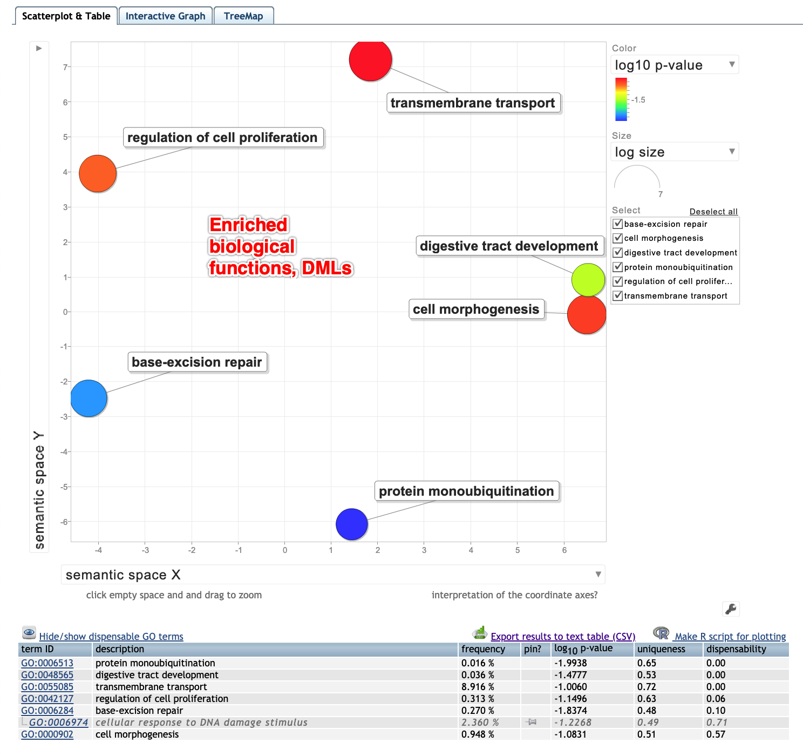
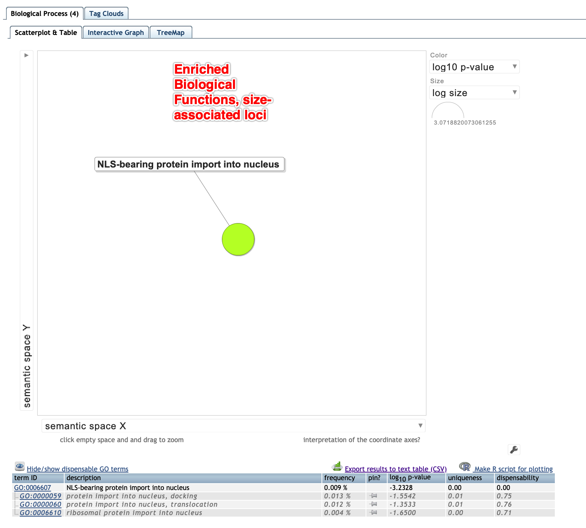

```{r, load packages, message=FALSE, warning=FALSE, results=FALSE, include=FALSE}
list.of.packages <- c("readr", "scales", "ggplot2", "methylKit", "vegan", "tidyverse", "reshape2", "ggpmisc") #add new libraries here 

new.packages <- list.of.packages[!(list.of.packages %in% installed.packages()[,"Package"])]
if(length(new.packages)) install.packages(new.packages)

# Load all libraries 
lapply(list.of.packages, FUN = function(X) {
  do.call("require", list(X)) 
})
```

```{r, data import, message=FALSE, warning=FALSE, results=FALSE, include=FALSE}
load("../analyses/methylation-filtered/R-objects/meth_filter")
load("../analyses/myobj_18")
load("../analyses/methylation-filtered/R-objects/perc.meth")
load("../analyses/DMLs/R-objects/allLociDML.summary")
load("../analyses/DMLs/R-objects/DML.summary")
load("../analyses/DMLs/R-objects/mydiff.all")
load("../analyses/DMLs/R-objects/dml25")
load("../analyses/meth_united_alldf")
load("../analyses/methylation-filtered/R-objects/loci.locations.long")
load("../analyses/methylation-filtered/R-objects/loci.locations")
load("../analyses/DMGs/R-objects/sub_meth_table_2kbslop")
load("../analyses/DMGs/R-objects/DMGs_2kbslop")
load("../analyses/DMGs/R-objects/DMLs.in.DMGs_2kbslop")
load("../analyses/DMLS/R-objects/DML.ratios")
load("../analyses/DMLs/R-objects/DMLs_heatmap")
load("../analyses/macau/R-objects/macau.FDR.length")
load("../analyses/DMLs/myDiff25p")
load("../analyses/macau/R-objects/macau.sign.length.perc.meth")
load("../analyses/macau/R-objects/size.macau")
load("../analyses/macau/R-objects/size.order")
load("../analyses/DMGs/R-objects/genes_2kbslop_Pst_DMGpvalue")
load("../analyses/methylation-characteristics/R-objects/merged_all_5x")
load("../analyses/methylation-characteristics/R-objects/merged_methylated_5x")
load("../analyses/methylation-characteristics/R-objects/methylated.summary") # doesn't exist anymore, update  
load("../analyses/methylation-characteristics/R-objects/methylation.overlap")  # doesn't exist anymore, update  
```

In this notebook I will compile results that I will include in the manuscript. 

### Description of general methylation patterns 

The MBD-Seq methylation data was examined to characterize general methylation patterns in _Ostrea lurida_. Reads were summed across all samples, and all cytosine loci that contained at minimum 5 reads (5x coverage) were used to characterize methylation. A cytosine locus was deemed methylated if 50% or more of the reads remained cytosines after bisulfite conversion (Gavery and Roberts 2013; Olson and Roberts 2013; Venkataraman et al. 2020). Of the `r prettyNum(nrow(merged_all_5x), big.mark = ",")` characterized loci, `r prettyNum(nrow(merged_methylated_5x), big.mark = ",")` were methylated (`r percent(nrow(merged_methylated_5x)/nrow(merged_all_5x), accuracy = .1)`). Of the methylated loci, `r prettyNum(methylated.summary["gene"], big.mark = ",")` were within known genes (`r percent(subset(methylation.overlap, feature=="gene")$methperc, accuracy = .1)`, `r percent(subset(methylation.overlap, feature=="exon")$methperc, accuracy = .1)` in exons, `r percent(subset(methylation.overlap, feature=="intron")$methperc, accuracy = .1)` in introns), `r prettyNum(methylated.summary["gene2kb"]-methylated.summary["gene"], big.mark = ",")` were 2kb upstream or downstream of known genes (`r percent(subset(methylation.overlap, feature=="geneflank2kb")$methperc, accuracy = .1)`), `r prettyNum(methylated.summary["TE"], big.mark = ",")` were within transposable elements (`r percent(subset(methylation.overlap, feature=="TE")$methperc, accuracy = .1)`), and there were `r prettyNum(methylated.summary["ASV"], big.mark = ",")` instances of overlap between methylated loci and alternative splice variants. `r prettyNum(methylated.summary["unknown"], big.mark = ",")` of the methylated loci were intergenic. 

### Description of methylation data used for DML and SAL analysis 

In total, `r prettyNum(nrow(meth_filter), big.mark = ",")` loci were analyzed. `r prettyNum(nrow(meth_united_alldf)-nrow(meth_filter), big.mark = ",")` loci were discarded because they did not pass the filtering requirements of 10-100 reads across 7 of the 9 samples per population.  

Overall, loci were highly methylated. Across all samples, loci were on average `r percent(mean(perc.meth, na.rm=TRUE)/100, accuracy = .1)` methylated. 

```{r, echo=FALSE, warning=FALSE}
hist(perc.meth, col="gray50", 
     xlab="Percent methylated",
     ylab="Frequency",
     main="Percent methylation, all evaluated loci across all samples")
```

Of all `r prettyNum(nrow(meth_filter), big.mark = ",")` evaluated loci, `r prettyNum(allLociDML.summary["gene"], big.mark = ",")` were located within known genes (`r percent(loci.locations[loci.locations$feature=="gene", "AllDMLperc"], accuracy=0.1)`), `r prettyNum(allLociDML.summary["exon"], big.mark = ",")` of which were located within exons (`r percent(loci.locations[loci.locations$feature=="exon", "AllDMLperc"], accuracy=0.1)`), `r prettyNum(allLociDML.summary["gene2kb"]-allLociDML.summary["gene"], big.mark = ",")` flanked known genes (within 2kb, `r percent(loci.locations[loci.locations$feature=="geneflank2kb", "AllDMLperc"], accuracy=0.1)`), `r prettyNum(allLociDML.summary["similarity"], big.mark = ",")` were found within transposable elements (`r percent(loci.locations[loci.locations$feature=="similarity", "AllDMLperc"], accuracy=0.1)`), and `r prettyNum(allLociDML.summary["unknown"], big.mark = ",")` were not found in any known feature (`r percent(loci.locations[loci.locations$feature=="unknown", "AllDMLperc"], accuracy=0.1)`). 

```{r, echo=FALSE, warning=FALSE}
ggplot(data=subset(loci.locations.long, feature=="gene" | feature=="geneflank2kb" | feature=="exon" | feature=="TE" | feature=="unknown"), aes(x=analysis, y=percent, fill=feature, label=percent(percent, accuracy = 0.1))) +  #prettyNum(count, big.mark = ",")
#  geom_bar(stat="identity", width = .5) +
  geom_bar(position="fill", stat="identity", width=0.5) +
  labs(y="No. of Loci", x=NULL) + 
  scale_fill_manual(name = "Loci Location", labels = c("Exon", "Gene Body", "Gene Flanking Regions (+/-2kb)", "Transposable Elements", "Unknown Regions"), 
                    values=c("#a6cee3", "#1f78b4", "#b2df8a","#33a02c", "#fb9a99")) + 
  ggtitle("Locations of DML and size-associated (MACAU) loci in genome\n with background loci locations") +
  theme_minimal() + geom_text(size = 3, position = position_fill(vjust = 0.5)) + 
  scale_x_discrete(labels=c("DML" = "DMLs",
                            "allLociDML" = "DML Background\nLoci",
                            "macau" = "Size-Associated\nLoci (MACAU)",
                            "allLociMACAU" = "MACAU Background\nLoci"))
```

### Differential methylation 

There were `r nrow(myDiff25p)` loci that were differentially methylated (DMLs) among populations. `r DML.summary["gene"]` loci were located within known genes (`r percent(loci.locations[loci.locations$feature=="gene", "DMLperc"], accuracy=0.1)`), `r DML.summary["exon"]` of which were within exons (`r percent(loci.locations[loci.locations$feature=="exon", "DMLperc"], accuracy=0.1)`), `r DML.summary["gene2kb"]-DML.summary["gene"]` DMLs flanked known genes (within 2kb, `r percent(loci.locations[loci.locations$feature=="geneflank2kb", "DMLperc"], accuracy=0.1)`), `r DML.summary["similarity"]` were located within transposable elements (`r percent(loci.locations[loci.locations$feature=="similarity", "DMLperc"], accuracy=0.1)`), and `r prettyNum(DML.summary["unknown"], big.mark = ",")` were not found in any known feature (`r percent(loci.locations[loci.locations$feature=="unknown", "DMLperc"], accuracy=0.1)`).  

```{r, results=FALSE, echo=FALSE, warning=FALSE, message=FALSE, fig.show='hide'}
PCA.filtered <- PCASamples(meth_filter, obj.return = T) #Run a PCA analysis on percent methylation for all samples. methylKit uses prcomp to create the PCA matrix
summary(PCA.filtered) #Look at summary statistics. The first PC explains 21.9% of variation, the second PC explains 18.3% of variation
```

```{r, echo=FALSE, warning=FALSE}
#Create dataframe with sample treatment information, color & symbol scheme 
plotCustomization <- data.frame(sample = 1:18, population=c(
                                rep("HC", times=9), 
                                rep("SS", times=9)),
                                color=c(rep("firebrick3", times=9),
                                rep("dodgerblue3", times=9)),
                                symbol=c(rep(16, times=9),
                                rep(17, times=9))) 

#pdf("../analyses/2018-10-25-MethylKit/2019-11-19-All-Data-PCA.pdf", width = 11, height = 8.5)
par(mar = c(5, 5, 1, 1)) #Specify inner and outer margins
PCA.figure <- ordiplot(PCA.filtered, choices = c(1, 2), type = "none", display = "sites", cex = 0.5, xlab = "", ylab = "", xaxt = "n", yaxt = "n") #Use ordiplot to create base biplot. Do not add any points
points(PCA.figure, "sites", col = as.character(plotCustomization$color), pch = plotCustomization$symbol, cex = 3) #Add each sample. Darker samples are ambient, lighter samples are elevated pCO2
#Add multiple white boxes on top of the default black box to manually change the color
box(col = "white")
box(col = "white")
box(col = "white")
box(col = "white")
box(col = "white")
box(col = "white")
box(col = "white")
box(col = "white")
box(col = "white")
box(col = "white")
ordiellipse(PCA.filtered, plotCustomization$population, show.groups = "HC", col = "firebrick3") #Add confidence ellipse around the samples in elevated pCO2
ordiellipse(PCA.filtered, plotCustomization$population, show.groups = "SS", col = "dodgerblue3") #Add confidence ellipse around the samples in ambient pCO2
axis(side =  1, labels = TRUE, col = "grey80", cex.axis = 1.7) #Add x-axis
mtext(side = 1, text = "PC 1 (21.9%)", line = 3, cex = 1.5) #Add x-axis label
axis(side =  2, labels = TRUE, col = "grey80", cex.axis = 1.7) #Add y-axis
mtext(side = 2, text = "PC 2 (18.3%)", line = 3, cex = 1.5) #Add y-axis label
legend("topleft", 
       pch = c(16, 17), 
       legend = c("Hood Canal", "South Sound"), 
       col = c(c("firebrick3", "dodgerblue3")), 
       cex = 1.6, bty = "n") #Add a legend with information about ambient and elevated samples
#dev.off()
```

```{r, echo=FALSE, warning=FALSE}
ggplot(DMLs_heatmap, aes(sample, chr_start, fill= percMeth)) + xlab("Sample") + geom_tile(na.rm = T) +
  scale_y_discrete(limits=(DML.ratios[order(DML.ratios$ratio_HC.SS),]$chr_start)) + 
  theme(axis.text.y=element_blank(),
        axis.ticks.y=element_blank()) + 
    ggtitle("Heatmap of Differentially Methylated Loci") +
  ylab("Loci") +
  scale_fill_distiller(name = "% Methylation", palette = "YlGnBu", direction = 1) #)
  #scale_fill_gradient(name = "% Methylation", low="gray5", high="white") black & white option 
```

#### Enriched Biological functions, DMLs 

The GO MWU analysis did not identify any enriched biological functions. Enrichment analysis using the DAVID tool identified 7 enriched biological processes (Table 1). 

#### Table 1: Enriched biological functions of genes that contain differentially methylated loci 

GO Term | Biological Process | PValue | Fold Enrichment | Count
-- | -- | -- | -- | --
GO:0006513 | protein monoubiquitination | 0.010 | 8.0 | 4
GO:0006284 | base-excision repair | 0.015 | 7.1 | 4
GO:0048565 | digestive tract development | 0.033 | 9.6 | 3
GO:0006974 | cellular response to DNA damage stimulus | 0.059 | 2.4 | 7
GO:0042127 | regulation of cell proliferation | 0.071 | 4.0 | 4
GO:0000902 | cell morphogenesis | 0.083 | 6.0 | 3
GO:0055085 | transmembrane transport | 0.099 | 2.8 | 5



#### Location of loci with high and low Pst values 

- What constitutes high and low? 

### Methylated gene regions 

Of the `r prettyNum(length(unique(sub_meth_table_2kbslop$gene)), big.mark = ",")` gene regions (genes +/- 2kb) assessed, `r length(unique(DMGs_2kbslop$gene))` were differentially methylated. Of these, there were `r nrow(DMLs.in.DMGs_2kbslop)` differentially methylated gene regions that contained DMLs (determined via a separate analysis). 

#### Enriched DMG functions 

**Biological Processes: regulation of protein kinase   activity (P-Value=0.072)**

| GCN1, eIF2 alpha kinase activator homolog(GCN1)  	| Q92616 	| Homo sapiens 	|
|--------------------------------------------------	|--------	|--------------	|
| kinase D-interacting substrate 220kDa(KIDINS220) 	| Q9ULH0 	| Homo sapiens 	|
| titin(TTN)                                       	| Q8WZ42 	| Homo sapiens 	|
| titin(Ttn)                                       	| A2ASS6 	| Mus musculus 	|

**Molecular   Functions: ligase activity (P-Value=0.087)**

| HECT domain containing 1(Hectd1)                                          	| Q69ZR2 	| Mus musculus           	|
|---------------------------------------------------------------------------	|--------	|------------------------	|
| HECT, UBA and WWE domain containing 1, E3 ubiquitin protein ligase(HUWE1) 	| Q7Z6Z7 	| Homo sapiens           	|
| PYruvate Carboxylase(pyc-1)                                               	| O17732 	| Caenorhabditis elegans 	|
| nuclear transcription factor, X-box binding 1(NFX1)                       	| Q12986 	| Homo sapiens           	|
| ring finger protein 103(Rnf103)                                           	| Q9R1W3 	| Mus musculus           	|
| ring finger protein 168(rnf168)                                           	| Q7T308 	| Danio rerio            	|
| ring finger protein 38(RNF38)                                             	| Q9H0F5 	| Homo sapiens           	|
| succinate-CoA ligase, alpha subunit(Suclg1)                               	| P13086 	| Rattus norvegicus      	|
| tripartite motif containing 2(TRIM2)                                      	| A4IF63 	| Bos taurus             	|
| tripartite motif-containing 2(Trim2)                                      	| D3ZQG6 	| Rattus norvegicus      	|
| ubiquitin protein ligase E3 component n-recognin 5(Ubr5)                  	| Q80TP3 	| Mus musculus           	|

**Molecular   Functions: DNA binding (P-Value=0.091)**

| AE binding protein 2(aebp2)                                               	| Q7SXV2 	| Danio rerio                   	|
|---------------------------------------------------------------------------	|--------	|-------------------------------	|
| AT-hook containing transcription factor 1 L homeolog(ahctf1.L)            	| Q5U249 	| Xenopus laevis                	|
| AT-rich interaction domain 2(ARID2)                                       	| Q68CP9 	| Homo sapiens                  	|
| E1A binding protein p400(Ep400)                                           	| Q8CHI8 	| Mus musculus                  	|
| GLIS family zinc finger 3(Glis3)                                          	| Q6XP49 	| Mus musculus                  	|
| HECT, UBA and WWE domain containing 1, E3 ubiquitin protein ligase(HUWE1) 	| Q7Z6Z7 	| Homo sapiens                  	|
| JRK-like(JRKL)                                                            	| Q9Y4A0 	| Homo sapiens                  	|
| Nuclear Hormone Receptor family(nhr-41)                                   	| Q9N4B8 	| Caenorhabditis elegans        	|
| PR domain containing 1, with ZNF domain(Prdm1)                            	| Q60636 	| Mus musculus                  	|
| PYruvate Carboxylase(pyc-1)                                               	| O17732 	| Caenorhabditis elegans        	|
| Putative histone H1.6(hil-6)                                              	| O16277 	| Caenorhabditis elegans        	|
| RAB guanine nucleotide exchange factor (GEF) 1(Rabgef1)                   	| Q9JM13 	| Mus musculus                  	|
| SET domain, bifurcated 1 L homeolog(setdb1.L)                             	| Q6INA9 	| Xenopus laevis                	|
| Zn finger homeodomain 1(zfh1)                                             	| P28166 	| Drosophila melanogaster       	|
| chromodomain helicase DNA binding protein 8(chd8)                         	| B0R0I6 	| Danio rerio                   	|
| conserved Plasmodium protein, unknown function(PF14_0175)                 	| Q8ILR9 	| Plasmodium falciparum 3D7     	|
| ligase I, DNA, ATP-dependent S homeolog(lig1.S)                           	| P51892 	| Xenopus laevis                	|
| methyl-CpG binding domain protein 6(Mbd6)                                 	| Q3TY92 	| Mus musculus                  	|
| orphan steroid hormone receptor 2(shr2)                                   	| Q26622 	| Strongylocentrotus purpuratus 	|
| regulatory factor X7(RFX7)                                                	| Q2KHR2 	| Homo sapiens                  	|
| transcription factor B1, mitochondrial(tfb1m)                             	| Q28HM1 	| Xenopus tropicalis            	|
| zinc finger and BTB domain containing 24(zbtb24)                          	| Q52KB5 	| Danio rerio                   	|
| zinc finger protein 236(ZNF236)                                           	| Q9UL36 	| Homo sapiens                  	|
| zinc finger protein 471(ZNF471)                                           	| Q9BX82 	| Homo sapiens                  	|
| zinc finger protein 525(ZNF525)                                           	| Q8N782 	| Homo sapiens                  	|
| zinc finger protein interacting with K protein 1(Zik1)                    	| Q80YP6 	| Mus musculus                  	|
| zinc finger, MYM-type 4(Zmym4)                                            	| A2A791 	| Mus musculus                  	|

**Cellular   Compoent: midbody (P-value=0.069)**

| CTD phosphatase subunit 1(CTDP1)                                      	| Q9Y5B0 	| Homo sapiens      	|
|-----------------------------------------------------------------------	|--------	|-------------------	|
| phosphatidylinositol transfer protein, membrane-associated 1(Pitpnm1) 	| Q5U2N3 	| Rattus norvegicus 	|
| septin 7(SEPT7)                                                       	| Q5R1W1 	| Pan troglodytes   	|
| supervillin(SVIL)                                                     	| O95425 	| Homo sapiens      	|
| supervillin(SVIL)                                                     	| O46385 	| Bos taurus        	|
| tetratricopeptide repeat domain 28(TTC28)                             	| Q96AY4 	| Homo sapiens      	|

#### Relationship between Pst values and DMG P-adjusted values 

```{r, echo=FALSE, warning=FALSE}
formula <- genes_2kbslop_Pst_DMGpvalue$adj.pval.pop ~ genes_2kbslop_Pst_DMGpvalue$Pst_Values
ggplot(genes_2kbslop_Pst_DMGpvalue, aes(x=Pst_Values, y=adj.pval.pop)) +
  geom_point(aes(colour = cut(adj.pval.pop, c(-Inf, 0.05, Inf)))) + 
  scale_color_manual(name = "DMG region significance",
                     values = c("(-Inf,0.05]" = "red",
                                  "(0.05, Inf]" = "black"),
                     labels = c("significant", "non-significant")) +
  ylab("P-Adjusted from diff. methylated gene region analysis") +
  xlab("Pst values, gene regions") + 
  ggtitle("Gene Region P-Adjusted ~ Pst") +
  geom_smooth(method = "lm", se = F) +
  stat_poly_eq(aes(label = paste(..eq.label.., ..rr.label.., sep = "~~~")), 
               label.x.npc = "right", label.y.npc = 0.85,
               formula = formula, parse = TRUE, size = 3, col="blue") +
  ylim(c(0,1))
```

#### Other ideas for DMGs  

- DMGs - what are the Fst values?  
- Which genes have low Pst values but are differentially methylated?  


### Methylated loci associated with size (MACAU) 

To examine whether methylation plays a role in population-specific growth traits, we modeled methylation level for each loci using MACAU, while controlling for relatedness. Of the `r prettyNum(nrow(macau.FDR.length),, big.mark = ",")` loci assessed, `r nrow(subset(macau.FDR.length, significant=="TRUE"))` loci were associated with oyster size (shell length, whole wet weight as covariate). Of the 20 loci, `r loci.locations[loci.locations$feature=="gene","macau"]` were located within known gene bodies (`r loci.locations[loci.locations$feature=="exon","macau"]` in exons),  and `r loci.locations[loci.locations$feature=="geneflank2kb","macau"]` locus flanked genes (+/- 2kb). The number of size-associated loci that were also differentially methylated among populations was `r nrow(subset(macau.FDR.length, significant=="TRUE") %>% mutate_at(vars(locus), funs(as.integer)) %>% dplyr::filter(contig %in% dml25$chr, locus %in% c(dml25$start+1)))`, which indicates that the associations were not primarily due to population structure. 

```{r, echo=FALSE, warning=FALSE}
as.matrix(macau.sign.length.perc.meth[, grep(c("numCs"), colnames(macau.sign.length.perc.meth))][size.order]) %>% 
  melt(value.name = "perc.meth", varnames = c("locus", "sample")) %>%
ggplot(aes(sample, locus, fill= perc.meth)) + xlab("Sample") + geom_tile(na.rm = T) +
  scale_x_discrete(breaks=colnames(as.matrix(macau.sign.length.perc.meth[, grep(c("numCs"), colnames(macau.sign.length.perc.meth))][size.order])), labels=c("10","1","7","4","6","8","2","9","11","13","14","3","15","5","17","18","12","16")) + 
  #scale_fill_viridis(discrete=FALSE) 
  theme(axis.title.y=element_blank(),
        axis.text.y=element_blank(),
        axis.ticks.y=element_blank()) + 
  ggtitle("Heatmap of Methylated Loci Associated with Oyster Size") + 
  ylab("Loci") +
  scale_fill_distiller(name = "% Methylation", palette = "YlGnBu", direction = 1, na.value="white")
  #scale_fill_gradient(low="gray5", high="white") 
```

```{r, echo=FALSE, warning=FALSE}
mycols <- c("firebrick3", "dodgerblue3")
par(oma=c(0,0,5,0))
barplot(size.macau[order(size.macau$y.Length),]$y.Length,  names.arg = size.macau[order(size.macau$y.Length),]$y.MBD.FILENAME, col = mycols[size.macau[order(size.macau$y.Length),]$pop], cex.names =  0.8, main = "Shell Length (mm)", las=2, space=1) #could add this to cut yaxis off at 10mm: (ylim=c(10,40), xpd = FALSE)
abline(h = 0, col = "black", lwd = 1)
legend("topleft", 
       pch = c(16, 17), 
       legend = c("Hood Canal", "South Sound"), 
       col = c(c("firebrick3", "dodgerblue3")), 
       cex = 1.2, bty = "n") #Add a legend with information about ambient and elevated samples
mtext(side = 1, text = "Sample", line = 2.25, cex = 1) #Add x-axis label
```

#### Enriched Biological functions, size-associated loci 

The GO MWU analysis did not identify any enriched biological functions. Enrichment analysis using the DAVID tool identified 4 enriched biological processes (Table 1). 

#### Table 2: Enriched biological functions of genes that contain loci which are associated with oyster size 

GO Term | Biologica Function | PValue | Fold Enrichment | Count
-- | -- | -- | -- | --
GO:0006607 | NLS-bearing protein import into nucleus | 5.85E-04 | 68.4 | 3
GO:0006610 | ribosomal protein import into nucleus | 0.02238718 | 79.8 | 2
GO:0000059 | protein import into nucleus, docking | 0.02791389 | 63.84 | 2
GO:0000060 | protein import into nucleus, translocation | 0.04432776 | 39.9 | 2



### Methylation and genetic data integration 

- Fst vs. Pst 
- Other correlations between genetic & epigenetic data? 

