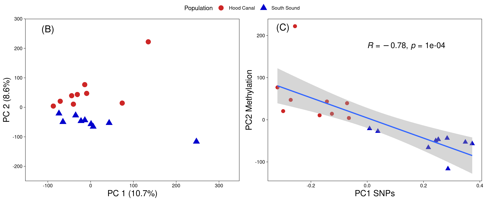
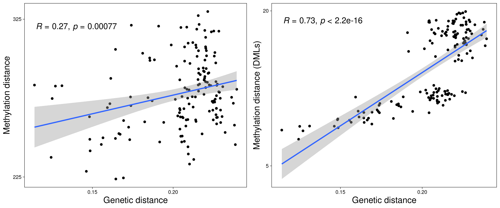

_Epigenetic and genetic population structure is coupled in a marine invertebrate_  
Katherine Silliman, Laura H. Spencer, Samuel J. White, Steven B. Roberts

```{r global_options, include=FALSE}
knitr::opts_chunk$set(fig.pos = 'H')
```

```{r, include=FALSE}
# Load libraries
list.of.packages <- c("spaa", "ggpubr", "tidyverse", "methylKit", "gridGraphics", "gridExtra", "vegan", "scales", "pryr", "corrplot", "kableExtra") #add libraries here 

# Install packages if needed
new.packages <- list.of.packages[!(list.of.packages %in% installed.packages()[,"Package"])]
if(length(new.packages)) install.packages(new.packages)

if (!require("BiocManager", quietly = TRUE))
    install.packages("BiocManager")

BiocManager::install("methylKit")

# Load packages 
lapply(list.of.packages, FUN = function(X) {
  do.call("require", list(X)) 
})

require(tidyverse)
```

### 1. General _O. lurida_ methylation characteristics  

**Supplemental Table 1**: Methylation coverage statistics. 

| sample | mean | median | var | sd | max | population |
|---|---|---|---|---|---|---|
| coverage1 | 12.61 | 12 | 37.65 | 6.14 | 100 | HC |
| coverage2 | 11.04 | 10 | 28.66 | 5.35 | 82 | HC |
| coverage3 | 12.28 | 11 | 36.98 | 6.08 | 99 | HC |
| coverage4 | 12.9 | 12 | 40.99 | 6.4 | 93 | HC |
| coverage5 | 9.96 | 9 | 25.55 | 5.05 | 92 | HC |
| coverage6 | 8.9 | 8 | 22.25 | 4.72 | 85 | HC |
| coverage7 | 13.82 | 13 | 41.28 | 6.43 | 97 | HC |
| coverage8 | 12.02 | 11 | 36.77 | 6.06 | 100 | HC |
| coverage9 | 14.96 | 14 | 42.8 | 6.54 | 88 | HC |
| coverage10 | 15.26 | 13 | 107.12 | 10.35 | 100 | SS |
| coverage11 | 15.95 | 12 | 167.15 | 12.93 | 97 | SS |
| coverage12 | 11.89 | 11 | 33.05 | 5.75 | 92 | SS |
| coverage13 | 18.55 | 17 | 84.6 | 9.2 | 103 | SS |
| coverage14 | 20.87 | 19 | 101.26 | 10.06 | 99 | SS |
| coverage15 | 19.58 | 17 | 131.26 | 11.46 | 99 | SS |
| coverage16 | 20.31 | 18 | 133.11 | 11.54 | 102 | SS |
| coverage17 | 14.7 | 13 | 74.64 | 8.64 | 108 | SS |
| coverage18 | 14.33 | 13 | 45.48 | 6.74 | 94 | SS |

_For detailed statistics of alignments prior to filtering, see [bs-alignment-stats.csv](https://github.com/sr320/paper-oly-mbdbs-gen/blob/master/supplemental-files/bs-alignment-stats.csv)_

```{r, echo=FALSE, results=FALSE, warning=FALSE, message=FALSE}
load(file="../analyses/methylation-characteristics/R-objects/allmeth")
load(file="../analyses/methylation-characteristics/R-objects/allmeth.5x")

# Frequency distribution of % methylation 
supp1a %<a-% hist(allmeth$meth_perc, col="gray85", 
                  xlab="% methylation per base", cex.main=.9,
     main="% methylation, no coverage minimum\n(all samples concatenated)") 

# Frequency distribution of % methylation 
supp1b %<a-% hist(allmeth.5x$meth_perc, col="gray85", 
     xlab="% methylation per base", cex.main=.9,
     main="% methylation, 5x minimum coverage\n(all samples concatenated)") 

supp.figure01 %<a-% {
  split.screen(c(1, 2))
  screen(1)
  supp1a
  screen(2)
  supp1b
  close.screen(all=TRUE)
}

supp.figure01

# tiff(file = "../figures/supp.figure01.tiff", width=3000, height=1250, res=250) 
# supp.figure01
# dev.off()
```

**Supplemental Figure 1**: Frequency distribution of % methylation in _O. lurida_ prior to filtering (left) and after filtering for loci with at minimum 5x coverage (right).   

**Supplemental Table 2**: Distribution of methylation in _Ostrea lurida_ draft genome in relation to all CpG loci.

| Feature | % of all CpGs in genome | % of all methylated loci | Ratio of  % meth:%CpG |
|---|---|---|---|
| Exon | 3.99% | 14.71% | 3.69 |
| Intron | 13.94% | 19.76% | 1.42 |
| 5’ flanking region (-2kb) | 3.91% | 4.64% | 1.19 |
| 3’ flanking region (+2kb) | 3.92% | 4.66% | 1.19 |
| Transposable Elements | 14.93% | 13.83% | 0.93 |
| Unknown genome regions | 56.01% | 32.25% | 0.58 |

---

```{r, echo=FALSE, results=FALSE, warning=FALSE, message=FALSE}
load(file="../analyses/methylation-characteristics/R-objects/loci.summary")

meth.chisq <- methdata.summary %>% filter(feature=="exon" | feature=="intron" | feature=="2kbflank-up" | feature=="2kbflank-down" | feature=="TE" | feature=="unknown") %>% 
  column_to_rownames("feature") %>% dplyr::select(CpGs, methylated) %>% chisq.test() 

supp2 %<a-% corrplot(meth.chisq$residuals, is.cor = FALSE, method="circle", cl.pos = 'n')

supp2

# tiff(file = "../figures/supp.figure02.tiff", width=750, height=1250, res=250) 
# supp2
# dev.off()
```


**Supplemental Figure 2**:  Top: Table showing the % of all CpG loci and methylated loci that overlap with each genomic feature. Bottom: A correlation plot, showing residuals from chi-squared tests of homogeneity on the distribution of methylated loci and CpG loci that intersect with features. Blue=positive associations, red=negative associations, and size of circles represents the absolute value of each correlation coefficient.  

---

```{r, echo=FALSE, results=FALSE, warning=FALSE, message=FALSE}
# load(file="../analyses/methylation-filtered/meth_filter_genes")
# 
# # Histogram showing frequency of methylated loci (min 50% meth) data across gene (relative location)
# supp.3a <- meth_filter_genes %>%
#   group_by(gene, gen_location) %>%
#   summarise(mean_meth=mean(percMeth)) %>%
#   filter(mean_meth>50) %>%
#   ggplot(., aes(x=gen_location)) +
#   stat_bin(bins=150, col="gray30", fill="lavenderblush3") +
#   xlab("Relative location along gene") +
#   ylab("Frequency of methylation data") +
#   ggtitle("A. methylation frequency relative to gene location") +
#   theme_minimal()
# #
# supp.3b <- meth_filter_genes %>%
#   ungroup() %>%
#   group_by(gen_location_round) %>%
#   summarise(mean_meth=mean(percMeth, na.rm=TRUE), sd_meth=sd(percMeth, na.rm=TRUE)) %>%
#   ggplot(., aes(x=gen_location_round, y=mean_meth)) +
#   geom_bar(stat="identity", col="gray30", fill="lavenderblush3") +
#   geom_errorbar(aes(ymin=mean_meth-sd_meth, ymax=mean_meth+sd_meth), width=.02,
#                  position=position_dodge(.9), ) +
#   scale_y_continuous(limits = c(0, 100)) +
#   xlab("Relative location along gene") +
#   ylab("Mean % methylation") +
#   ggtitle("B. % methylation by relative gene location") +
#   theme_minimal()
# #
# #Plot methylation variance by gene location
# supp.3c <- meth_filter_genes %>%
#   ungroup() %>%
#   group_by(gen_location_round) %>%
#   summarise(var_meth=var(percMeth, na.rm=TRUE)) %>%
#   ggplot(., aes(x=gen_location_round, y=var_meth)) +
#   geom_bar(stat="identity", col="gray30", fill="lavenderblush3") +
#   xlab("Relative location along gene") +
#   ylab("Variance in % methylation") +
#   ggtitle("C. variance in % methylation by relative gene location") +
#   theme_minimal()
# 
# supp.figure03 <- ggarrange(supp.3a, supp.3b, supp.3c, ncol=1, nrow=3)
# 
# png(file = "../supplemental-files/Supp-03.png", width=1500, height=3500, res=250) 
# supp.figure03
# dev.off()
```


{width=60%}

---

**Supplemental Table 3**:  Biological functions that are enriched in methylated genes the _Ostrea lurida_ genome. Also available in .csv format: https://github.com/sr320/paper-oly-mbdbs-gen/blob/master/analyses/methylation-characteristics/methylated-loci-enriched-BP.csv 

| GO Term | Biological Process | PValue | FDR | GO slim |
|---|---|---|---|---|
| GO:0007067 | mitotic nuclear division | 0 | 0.37 | cell cycle and proliferation |
| GO:0007049 | cell cycle | 0 | 0.66 | cell cycle and proliferation |
| GO:0051321 | meiotic cell cycle | 0.05 | 1 | cell cycle and proliferation |
| GO:0000082 | G1/S transition of mitotic cell cycle | 0.07 | 1 | cell cycle and proliferation |
| GO:0000086 | G2/M transition of mitotic cell cycle | 0.09 | 1 | cell cycle and proliferation |
| GO:0007067 | mitotic nuclear division | 0 | 0.37 | cell organization and biogenesis |
| GO:0016569 | covalent chromatin modification | 0.01 | 1 | cell organization and biogenesis |
| GO:0060271 | cilium morphogenesis | 0.01 | 1 | cell organization and biogenesis |
| GO:0042384 | cilium assembly | 0.01 | 1 | cell organization and biogenesis |
| GO:0007030 | Golgi organization | 0.02 | 1 | cell organization and biogenesis |
| GO:0030030 | cell projection organization | 0.05 | 1 | cell organization and biogenesis |
| GO:0007005 | mitochondrion organization | 0.05 | 1 | cell organization and biogenesis |
| GO:0001822 | kidney development | 0.02 | 1 | developmental processes |
| GO:0001843 | neural tube closure | 0.07 | 1 | developmental processes |
| GO:0006281 | DNA repair | 0 | 0.08 | DNA metabolism |
| GO:0006260 | DNA replication | 0 | 0.37 | DNA metabolism |
| GO:0006310 | DNA recombination | 0.04 | 1 | DNA metabolism |
| GO:0006302 | double-strand break repair | 0.08 | 1 | DNA metabolism |
| GO:0006284 | base-excision repair | 0.09 | 1 | DNA metabolism |
| GO:0051301 | cell division | 0 | 0.12 | other biological processes |
| GO:0007018 | microtubule-based movement | 0.02 | 1 | other biological processes |
| GO:0042254 | ribosome biogenesis | 0.05 | 1 | other biological processes |
| GO:0016032 | viral process | 0.05 | 1 | other biological processes |
| GO:0043547 | positive regulation of GTPase activity | 0.05 | 1 | other biological processes |
| GO:0000910 | cytokinesis | 0.06 | 1 | other biological processes |
| GO:0032092 | positive regulation of protein binding | 0.08 | 1 | other biological processes |
| GO:0008104 | protein localization | 0.09 | 1 | other biological processes |
| GO:0031047 | gene silencing by RNA | 0.01 | 1 | other metabolic processes |
| GO:0006511 | ubiquitin-dependent protein catabolic process | 0 | 0.12 | protein metabolism |
| GO:0006412 | translation | 0 | 0.37 | protein metabolism |
| GO:0050821 | protein stabilization | 0.01 | 1 | protein metabolism |
| GO:0006468 | protein phosphorylation | 0.01 | 1 | protein metabolism |
| GO:0006413 | translational initiation | 0.03 | 1 | protein metabolism |
| GO:0000209 | protein polyubiquitination | 0.06 | 1 | protein metabolism |
| GO:0042787 | protein ubiquitination involved in ubiquitin-dependent protein catabolic process | 0.08 | 1 | protein metabolism |
| GO:0016567 | protein ubiquitination | 0.09 | 1 | protein metabolism |
| GO:0000398 | mRNA splicing, via spliceosome | 0 | 0.53 | RNA metabolism |
| GO:0006397 | mRNA processing | 0 | 1 | RNA metabolism |
| GO:0006364 | rRNA processing | 0.01 | 1 | RNA metabolism |
| GO:0006396 | RNA processing | 0.01 | 1 | RNA metabolism |
| GO:0008380 | RNA splicing | 0.02 | 1 | RNA metabolism |
| GO:0006366 | transcription from RNA polymerase II promoter | 0.05 | 1 | RNA metabolism |
| GO:0008033 | tRNA processing | 0.06 | 1 | RNA metabolism |
| GO:0006355 | regulation of transcription, DNA-templated | 0.09 | 1 | RNA metabolism |
| GO:0006974 | cellular response to DNA damage stimulus | 0 | 0.05 | stress response |
| GO:0006281 | DNA repair | 0 | 0.08 | stress response |
| GO:0006302 | double-strand break repair | 0.08 | 1 | stress response |
| GO:0006284 | base-excision repair | 0.09 | 1 | stress response |
| GO:0015031 | protein transport | 0 | 0.23 | transport |
| GO:0006886 | intracellular protein transport | 0 | 0.81 | transport |
| GO:0006888 | ER to Golgi vesicle-mediated transport | 0 | 0.96 | transport |
| GO:0016192 | vesicle-mediated transport | 0.02 | 1 | transport |
| GO:0006406 | mRNA export from nucleus | 0.04 | 1 | transport |
| GO:0006606 | protein import into nucleus | 0.09 | 1 | transport |
| GO:0042147 | retrograde transport, endosome to Golgi | 0.1 | 1 | transport |
| GO:0098609 | cell-cell adhesion | 0.04 | 1 | NA |
| GO:0070936 | protein K48-linked ubiquitination | 0.07 | 1 | NA |
| GO:0003341 | cilium movement | 0.07 | 1 | NA |

--- 

### 2. Differential methylation analysis among populations    

```{r, echo=FALSE, results=FALSE, warning=FALSE, message=FALSE}
load("../analyses/DMLs/R-objects/DMLs_heatmap")
load("../analyses/DMLs/R-objects/DML.ratios")

#ggplotly(
ggplot(DMLs_heatmap, aes(sample, chr_start, fill= percMeth)) + xlab("Sample") + geom_tile(na.rm = T) +
  scale_y_discrete(limits=(DML.ratios[order(DML.ratios$ratio_HC.SS),]$chr_start)) + 
  #scale_fill_viridis(discrete=FALSE) 
  theme(axis.title.y=element_blank(),
        axis.text.y=element_blank(),
        axis.ticks.y=element_blank()) + 
  scale_fill_distiller(palette = "YlGnBu", direction = 1) +
coord_cartesian(ylim = c(0, NA), clip = "off") + xlab("") +
  annotate("segment", x = 1, xend = 9, y = -225, yend = -225, colour="firebrick3") +
    annotate("segment", x = 10, xend = 18, y = -225, yend = -225, colour="dodgerblue3") +
  annotate("text", x = 5, y = -325, colour="firebrick3", label="Hood Canal") +
    annotate("text", x = 14, y = -325, colour="dodgerblue3", label="South Sound")#)#)
  #scale_fill_gradient(low="gray5", high="white")
```

**Supplemental Figure 4**: Heat map of loci that are differentially methylated (DMLs) between the two populations.   

---

```{r, echo=FALSE, results=FALSE, warning=FALSE, message=FALSE}
load(file="../analyses/DMLs/R-objects/PCA.figure")

PC.coord <- PCA.figure$sites %>% as_tibble() %>% 
  cbind(Population=c(rep("Hood Canal", times=9), rep("South Sound", times=9))) %>% 
  mutate(Population=as.factor(Population))

(supp5 <- ggplot(PC.coord, aes(x=PC1,y=PC2)) + 
  geom_point(aes(shape=Population,color=Population),size=4) +
  scale_shape_manual(values=c(16,17)) + 
  scale_color_manual(values=c("firebrick3", "blue3")) +
  theme_linedraw()+
theme(
axis.title.x = element_text( size=15),
axis.title.y = element_text(size=15),
panel.grid.major = element_blank(),
panel.grid.minor = element_blank(),
legend.position = "right"
) + 
    xlab("PC 1 (36.3%)") + ylab("PC 2 (8.47%%)") +
      xlim(-29,30) + ylim(-21,28))
```

**Supplemental Figure 5**: PCA of methylation data using DMLs only   

---

```{r, echo=FALSE, results=FALSE, warning=FALSE, message=FALSE}
load("../analyses/DMLs/R-objects/DML.ratios")

DML.ratios %>% 
           mutate(hypermethylated=ifelse(diff_HC.SS>0, "HC", "SS")) %>%
  ggplot(aes(x = chr_start, y = diff_HC.SS, fill=hypermethylated)) +
  geom_bar(stat = "identity", width=0.41) +
    scale_x_discrete(limits=(DML.ratios[order(DML.ratios$diff_HC.SS),]$chr_start)) + 
  scale_y_continuous(limits=c(-80,80), breaks=c(-75, -50, -25, 0),
                       labels=c("-75"="75%", "-50"="50%", "-25"="25%", "0"="0%"),
                     sec.axis = sec_axis(trans=~.*1, breaks=c(75, 25, 50, 0),
                       labels=c("-75"="75%", "-50"="50%", "-25"="25%", "0"="0%")))  +
    theme(axis.text.y=element_blank(), axis.ticks.y = element_blank(), 
          legend.position = "none", text = element_text(size=14, color="gray30"),
          panel.background = element_blank(),
          panel.border = element_rect(colour = "gray30", fill=NA, size=.4)) +
    #ggtitle("DMLs, showing % methylation difference among populations") +
    scale_fill_manual(values=c("firebrick3", "dodgerblue3")) +
    # annotate(geom="text", x=-20, y=-65, label="Loci hypermethylated in\nSouth Sound", color="dodgerblue3") +
    # annotate(geom="text", x=260, y=62, label="Loci hypermethylated in\nHood Canal", color="firebrick3") +
  ylab("% methylation difference among populations") + xlab("Locus") + coord_flip()
```

**Supplemental Figure 6**: The % difference between each population’s mean methylation for differentially methylated loci, which highlights that both populations have a similar number of hyper/hypo-methylated loci. Loci are sorted by % methylation difference.  

---

**Supplemental Table 4**: GO terms and GO Slim terms of biological functions enriched in DMGs & DMLs. EASE scores shown. FDR for all terms is 1.0. Also available in .csv format: https://github.com/sr320/paper-oly-mbdbs-gen/blob/master/analyses/DMG-DML-EnrichedBP.csv 

| Go Slim | Term | Function | DMG | DML |
|---|---|---|---|---|
| cell adhesion | GO:0007155 | cell adhesion | 0.012 |   |
| cell adhesion | GO:0007156 | homophilic cell adhesion via plasma membrane adhesion molecules | 0.026 | 0.00091 |
| cell adhesion | GO:0016339 | calcium-dependent cell-cell adhesion via plasma membrane cell adhesion molecules |   | 0.083 |
| cell organization and biogenesis | GO:0007015 | actin filament organization | 0.014 |   |
| cell organization and biogenesis | GO:0048675 | axon extension | 0.047 |   |
| cell organization and biogenesis | GO:0007411 | axon guidance | 0.063 |   |
| cell organization and biogenesis | GO:0000904 | cell morphogenesis involved in differentiation | 0.095 |   |
| cell organization and biogenesis | GO:0030198 | extracellular matrix organization | 0.033 |   |
| cell organization and biogenesis | GO:0032836 | glomerular basement membrane development | 0.046 |   |
| cell organization and biogenesis | GO:0007040 | lysosome organization | 0.047 |   |
| cell organization and biogenesis | GO:0031023 | microtubule organizing center organization | 0.095 |   |
| cell organization and biogenesis | GO:0051259 | protein oligomerization | 0.098 |   |
| cell organization and biogenesis | GO:0048841 | regulation of axon extension involved in axon guidance | 0.033 |   |
| cell organization and biogenesis | GO:0045214 | sarcomere organization | 0.069 | 0.019 |
| cell organization and biogenesis | GO:0055003 | cardiac myofibril assembly |   | 0.082 |
| cell organization and biogenesis | GO:0032438 | melanosome organization |   | 0.021 |
| cell organization and biogenesis | GO:0045332 | phospholipid translocation |   | 0.0058 |
| death | GO:0008625 | extrinsic apoptotic signaling pathway via death domain receptors | 0.095 |   |
| developmental processes | GO:0048675 | axon extension | 0.047 |   |
| developmental processes | GO:0007411 | axon guidance | 0.063 |   |
| developmental processes | GO:0032836 | glomerular basement membrane development | 0.046 |   |
| developmental processes | GO:0048841 | regulation of axon extension involved in axon guidance | 0.033 |   |
| developmental processes | GO:0045214 | sarcomere organization | 0.069 | 0.019 |
| developmental processes | GO:0007423 | sensory organ development | 0.095 |   |
| developmental processes | GO:0055003 | cardiac myofibril assembly |   | 0.082 |
| developmental processes | GO:0060429 | epithelium development |   | 0.071 |
| developmental processes | GO:0040027 | negative regulation of vulval development |   | 0.082 |
| developmental processes | GO:0021942 | radial glia guided migration of Purkinje cell |   | 0.082 |
| developmental processes | GO:0050767 | regulation of neurogenesis |   | 0.0058 |
| developmental processes | GO:0060438 | trachea development |   | 0.082 |
| developmental processes | GO:0001570 | vasculogenesis |   | 0.047 |
| other biological processes | GO:0016477 | cell migration | 0.029 | 0.032 |
| other biological processes | GO:0007281 | germ cell development | 0.048 |   |
| other biological processes | GO:0019915 | lipid storage | 0.043 |   |
| other biological processes | GO:0048477 | oogenesis | 0.046 |   |
| other biological processes | GO:0040008 | regulation of growth | 0.032 |   |
| other biological processes | GO:0042254 | ribosome biogenesis | 0.092 |   |
| other biological processes | GO:0019233 | sensory perception of pain | 0.016 |   |
| other biological processes | GO:0006879 | cellular iron ion homeostasis |   | 0.047 |
| other biological processes | GO:0050982 | detection of mechanical stimulus |   | 0.082 |
| other biological processes | GO:0050801 | ion homeostasis |   | 0.082 |
| other biological processes | GO:0007017 | microtubule-based process |   | 0.082 |
| other biological processes | GO:0032465 | regulation of cytokinesis |   | 0.057 |
| other biological processes | GO:0006941 | striated muscle contraction |   | 0.082 |
| other metabolic processes | GO:0042157 | lipoprotein metabolic process | 0.095 |   |
| other metabolic processes | GO:0010508 | positive regulation of autophagy | 0.063 |   |
| other metabolic processes | GO:0010923 | negative regulation of phosphatase activity |   | 0.028 |
| protein metabolism | GO:0031398 | positive regulation of protein ubiquitition | 0.098 | 0.093 |
| protein metabolism | GO:0016567 | protein ubiquitition |   | 0.0033 |
| protein metabolism | GO:0042787 | protein ubiquitition involved in ubiquitin-dependent protein catabolic process |   | 0.003 |
| signal transduction | GO:0046426 | negative regulation of JAK-STAT cascade |   | 0.071 |
| stress response | GO:0042594 | response to starvation |   | 0.03 |
| transport | GO:0006895 | Golgi to endosome transport | 0.043 | 0.019 |
| transport | GO:0034220 | ion transmembrane transport | 0.086 | 0.00049 |
| transport | GO:0008333 | endosome to lysosome transport |   | 0.083 |
| transport | GO:0045332 | phospholipid translocation |   | 0.0058 |
| NA  | GO:0044331 | cell-cell adhesion mediated by cadherin | 0.033 | 0.071 |
| NA  | GO:0072015 | glomerular visceral epithelial cell development | 0.095 |   |
| NA  | GO:0086010 | membrane depolarization during action potential | 0.095 |   |
| NA  | GO:1903955 | positive regulation of protein targeting to mitochondrion | 0.0082 |   |
| NA  | GO:0038061 | NIK/NF-kappaB sigling |   | 0.071 |
| NA  | GO:0090175 | regulation of establishment of plar polarity |   | 0.082 |

---

### 3. Genetic Structure  

```{r, echo=FALSE, results=FALSE, warning=FALSE, message=FALSE}
# assembling the input table
inName="../analyses/2bRAD/PopGen/HCSS_Afilt32m70_01_K2_run1.qopt" # name of the input file to plot, output of ngsAdmix or ADMIXTURE run
npops=2
pops="../analyses/2bRAD/Inputs/SSHCfiltNreps.ind2pop" # 2-column tab-delimited table of individual assignments to populations; must be in the same order as samples in the bam list or vcf file.
tbl=read.table(inName,header=F)
i2p=read.table(pops,header=F)
names(i2p)=c("ind","pop")
tbl=cbind(tbl,i2p)
row.names(tbl)=tbl$ind

#head(tbl,5) # this is how the resulting dataset must look

source("plot_admixture_v5_function.R") # file from z0on github

# putting populations in desired order (edit pop names as needed or skip to plot them alphabetically)
tbl$pop=factor(tbl$pop,levels=c("HC","SS"),labels = c("Hood Canal","South Sound"))

ords=plotAdmixture(data=tbl,npops=npops,angle=0,vshift=0.05,hshift=0,colors = c("red","blue"))
```

**Supplemental Figure 7**: Admixture plot for 114 individuals at K=2 (determined to be the best K using the Evanno method), based on 3,724 SNPs.  

---

**Supplemental Table 5**: Annotations for outlier SNPs that fall within 2kb of a gene. Also available in .bed format, [HCSS_Afilt32m70_01_BS-gene2kb.bed](https://github.com/sr320/paper-oly-mbdbs-gen/blob/master/analyses/analyses/2bRAD/PopGen/HCSS_Afilt32m70_01_BS-gene2kb.bed)  

```{r, echo=FALSE, warning=FALSE, message=FALSE}
genes2kb <- read.table("../analyses/2bRAD/PopGen/HCSS_Afilt32m70_01_BS-gene2kb.bed",header = F,sep = "\t", col.names = c("SNP.Contig","SNP.start","SNP.end","Feature.Contig","source","feature","feature.start","feature.end","some1", "strand","something","attribute"))
genes2kb <- genes2kb[,c("SNP.Contig","SNP.start","Feature.Contig","feature.start","feature.end","feature","attribute")] %>% mutate(ID=str_extract(attribute, "ID=(.*?);"),
       Parent=str_extract(attribute, "Parent=(.*?);"),
       Name=str_extract(attribute, "Name=(.*?);"),
       Alias=str_extract(attribute, "Alias=(.*?);"),
       AED=str_extract(attribute, "AED=(.*?);"),
       eAED=str_extract(attribute, "eAED=(.*?);"),
       Note=str_extract(attribute, "Note=(.*?);"),
       Ontology_term=str_extract(attribute, "Ontology_term=(.*?);"),
       Dbxref=str_extract(attribute, "Dbxref=(.*?);"),
       uniprotID=str_extract(attribute, "SPID=(.*?);")) %>%
       mutate(ID=str_remove(ID, "ID=")) %>% mutate(ID=str_remove(ID, ";"))
genes2kb <- genes2kb[,c("SNP.Contig","SNP.start","Feature.Contig","feature.start","feature.end","feature","ID","Note","Ontology_term")]
colnames(genes2kb) <- c("SNP Contig","SNP Position","Feature Contig", "Feature Start","Feature End","Feature Type","Genome ID","Gene Name","GO Terms")
kbl(genes2kb) %>%
  kable_styling(font_size = 8, latex_options = c("HOLD_position","scale_down"))
```

---

**Supplemental Table 6**: DAVID enrichment results for genes with F<sub>ST</sub> > 0.3. Also available in .tsv format, [fst_g03_david.tab](https://github.com/sr320/paper-oly-mbdbs-gen/blob/master/analyses/analyses/2bRAD/PopGen/fst_g03_david.tab) 

```{r, echo=FALSE, warning=FALSE, message=FALSE}
d <- read.table("../analyses/2bRAD/PopGen/fst_g03_david.tab",header=T,sep="\t")

d <- d[,c(1,2,3,4,5,10,13)]
colnames(d)[4] <- "Percent.Genes"

d %>% mutate_if(is.numeric, format, digits=3,nsmall = 0) %>%
  kable(., col.names = gsub("[.]", " ", names(.))) %>%
  kable_styling(font_size = 10, latex_options = c("HOLD_position","scale_down"))
```

---

### 4. mQTL analysis  

![**Supplemental Figure 8:**  Comparison of mQTL results that intersect with the following genomic features: exon, intron, promoter region (within 2kb of the 5’ end of a gene), gene region (genes plus 2kb upstream and downstream), transposable element, and unknown region of genome. A) SNPs designated as either local (red, within 50kb) or distant (orange) mQTLs, compared with the background (blue) of all SNPs used in the mQTL analysis. B) CpGs associated with either local (red) or distant (orange) mQTLs, compared to the background (blue) of all CpGs used in the mQTL](../supplemental-files/Supp-09.png){width=70%}   
  
---

### 5. Genetic and epigenetic relationship at 10x MBD coverage  

```{r, echo=FALSE,out.width="75%",out.height="30%",fig.cap="Supplemental Figure 9: Epigenetic divergence as a function of genetic distance, using CpG methylation data with a 10x coverage threshold. The y axes are the Manhattan distances from CpG methylation x1000 (a; using all methylation data and b; using DMLs). The linear regression lines are shown, together with the Pearson and Spearman correlation coefficients.", fig.show='hold',fig.align='center'}
knitr::include_graphics(c("../supplemental-files/10x_distance.png","../supplemental-files/10x_distance_dml.png"))
``` 
 
---

### 6. Genetic and epigenetic relationship at 5x coverage with NA values replacing data for the 1 or 2 samples not meeting coverage 

For our comparative methylation analyses we filter for loci for which there is methylation data in at least 7 of the 9 samples in each population. This results in up to 2 samples that may not meet coverage thresholds, but which are included in analyses (e.g. PCA, distance matrix, differential methylation, etc.). We do agree that ideally all loci in all individuals would meet coverage thresholds, however given the nature of data derived from MBD-Seq library preparation (which is enriched for methylated regions), relaxing this setting was important to capture some loci with lower methylation levels in a population. Additionally, had we required that all samples meet 5x coverage thresholds, this would drastically reduce the dataset such that integration with genetic data would be quite limited. To examine how the the inclusion of data at loci with low coverage in 1-2 individuals per population affects our results, we re-ran methylation analyses where NA values replaced the up to 2 samples that did not meet 5x coverage threshold, and found that this approach slightly decreased noise in the methylation data, but did not qualitatively affect the relationships observed between the genome and epigenome, or the conclusions drawn therein. Here we provide key statistical results from methylation analyses, and figures that demonstrate the limited effects of these filtering changes on our conclusions about the relationship between genetic and epigenetic population structure:  

| Statistic | Analysis in main text | Revised analysis for supplemental |
|---|---|---|
| Number of differentially methylated loci (DMLs) | 3,963 | 3,911 |
| DMLs in genes | 1,915 | 1,873 |
| DMLs in exons | 1,504 | 1,463 |
| DMLs upstream of genes | 178 | 180 |
| DMLs downstream of genes | 171 | 171 |
| DMLs in transposable elements | 188 | 188 |
| DMLs in no known feature | 500 | 497 |
| % of DMLs with higher methylation in South Sound population | 54% | 54% |
| Number of differentially methylated genes | 1,447 | 1,462 |
| Average Pst across random 10kb bins | 0.30 +/- SD 0.26 | 0.30 +/- SD 0.25 |

```{r,echo=FALSE, results=FALSE, warning=FALSE, message=FALSE}
# Supp figure 10
 # 10b PCA of methylation data
ep <- read.table("../analyses/5x_SuppFiltering/PC-scores-filtered-methylation_Suppfilt.tab",
                 header=T, sep="\t",row.names = "sample")
#add sample names
key = read.csv("../data/sample-key.csv",colClasses = c("character","character"))
samples = rownames(ep)
mapdf <- data.frame(old=key$MBD.FILENAME,new=key$SAMPLE)
rownames(ep) <- mapdf$new[match(samples,mapdf$old)]

mbdorder = c("hc1_2","hc1_4","hc2_15","hc2_17","hc3_1","hc3_10","hc3_11","hc3_5","hc3_7",
  "ss2_14","ss2_18","ss2_9","ss3_14","ss3_15","ss3_16","ss3_20","ss3_3","ss5_18")
#make sure ep and gen in same order
ep <- ep[mbdorder,]

Population <- as.factor(c(rep("Hood Canal",9),rep("South Sound",9)))
pc1pc2 <- cbind(ep[,c("PC1","PC2")],Population)

fig10b <- ggplot(pc1pc2, aes(x=PC1,y=PC2)) + 
  geom_point(aes(shape=Population,color=Population),size=4) +
  scale_shape_manual(values=c(16,17)) + 
  scale_color_manual(values=c("firebrick3", "blue3")) +
  theme_linedraw()+
theme(
axis.title.x = element_text( size=15),
axis.title.y = element_text(size=15),
panel.grid.major = element_blank(),
panel.grid.minor = element_blank(),
legend.position = "none"
) +  
  xlim(-130,325) + ylim(-225,275) +
  xlab("PC 1 (10.7%)") + ylab("PC 2 (8.6%)")  +
  annotate("text", x = -100, y = 266, label = "(B)", size=6) 

## Correlation of methylation PC2 and SNP PC1, 10c

gen <- read.table("../analyses/2bRAD/MethGen/MBD_pca_covMat.tsv")
rownames(gen) <- mbdorder

both <- merge(ep[,"PC2"],gen[,"PC1"],by="row.names",sort=F)
Population <- as.factor(c(rep("Hood Canal",9),rep("South Sound",9)))
both <- cbind(both,Population)

fig10c <- ggplot(both, aes(x=y,y=x)) + 
  geom_point(aes(shape=Population,color=Population),size=3) +
  scale_shape_manual(values=c(16,17)) + 
  scale_color_manual(values=c("firebrick3", "blue3")) +
    geom_smooth(method=lm) +
  theme_linedraw()+
theme(
axis.title.x = element_text( size=15),
axis.title.y = element_text(size=15),
panel.grid.major = element_blank(),
panel.grid.minor = element_blank(),
legend.position = "bottom",
legend.title=element_blank(),
legend.text=element_text(size=15)
) +
  xlab("PC1 SNPs") + ylab("PC2 Methylation")  +
   stat_cor(method = "pearson", label.x = 0., label.y = 175,size=5,p.digits = 0.001) +
  guides(colour = guide_legend(override.aes = list(size=5)))  +
  annotate("text", x = -0.3, y = 220, label = "(C)", size=6) 
```

```{r,echo=FALSE, results=FALSE, warning=FALSE, message=FALSE,fig.show='hide'}
(figure10 <- ggarrange(fig10b,  
                       fig10c, 
                       ncol=2, nrow=1,
                       common.legend = TRUE, legend="top"))

png(file = "../supplemental-files/Supp-10.png", width=3000, height=1250, res=250)
figure10
dev.off()
```

{width=90%} 


```{r, echo=FALSE, results=FALSE, warning=FALSE, message=FALSE}
# Figure 11a
## Correlation of Epigenetic/Genetic Distance  
ep10 <-read.csv("../analyses/methylation-filtered/dist.manhat.csv",header = T)
ep10 <- ep10[,c("SampNum.row","SampNum.col","dist.manh")]
ep10 <- as.matrix(list2dist(ep10))
mbdorder = c("hc1_2","hc1_4","hc2_15","hc2_17","hc3_1","hc3_5","hc3_7","hc3_10","hc3_11",
        "ss2_9","ss2_14","ss2_18","ss3_3","ss3_14","ss3_15","ss3_16","ss3_20","ss5_18")
ep10 <- ep10[mbdorder, mbdorder]

gen <- read.table("../analyses/2bRAD/PopGen/HCSS_Afilt32m70_01_mbd.dist", row.names = 1, header=T)

df <- data.frame( gen=gen[lower.tri(gen)], ep=ep10[ lower.tri(ep10)])

fig11a <- ggplot(df, aes(x=gen,y=ep)) + geom_point(shape=19) +    # Use hollow circles
    geom_smooth(method=lm) +
  theme_linedraw()+
theme(
axis.title.x = element_text( size=15),
axis.title.y = element_text(size=15),
panel.grid.major = element_blank(),
panel.grid.minor = element_blank()
) +
  xlab("Genetic distance") + ylab("Methylation distance")  +
  scale_y_continuous(breaks = c(2250000,3250000),labels = c("225","325"))+
   stat_cor(method = "pearson", label.x = 0.115, label.y = 3200000,size=5)
```

```{r, echo=FALSE, results=FALSE, warning=FALSE, message=FALSE}
# Figure 11b
## Correlation of Epigenetic/Genetic Distance (DML) 

#load("../analyses/2bRAD/MethGen/dist_allmeth_snp.Robj")
ep10 <-read.csv("../analyses/methylation-filtered/dist.manhat.DMLs.csv",header = T)
ep10 <- ep10[,c("SampNum.row","SampNum.col","dist.manh")]
ep10 <- as.matrix(list2dist(ep10))
mbdorder = c("hc1_2","hc1_4","hc2_15","hc2_17","hc3_1","hc3_5","hc3_7","hc3_10","hc3_11",
        "ss2_9","ss2_14","ss2_18","ss3_3","ss3_14","ss3_15","ss3_16","ss3_20","ss5_18")
ep10 <- ep10[mbdorder, mbdorder]

df <- data.frame( gen=gen[lower.tri(gen)], ep=ep10[ lower.tri(ep10)])

fig11b <- ggplot(df, aes(x=gen,y=ep)) + geom_point(shape=19) +    # Use hollow circles
    geom_smooth(method=lm) +
  theme_linedraw()+
theme(
axis.title.x = element_text( size=15),
axis.title.y = element_text(size=15),
panel.grid.major = element_blank(),
panel.grid.minor = element_blank()
) +
  xlab("Genetic distance") + ylab("Methylation distance (DMLs)")  +
  scale_y_continuous(breaks = c(50000,200000),labels = c("5","20"))+
   stat_cor(method = "pearson", label.x = 0.115, label.y = 190000,size=5,p.digits = 0.001)

```

```{r, echo=FALSE, results=FALSE, warning=FALSE, message=FALSE,fig.show='hide'}
(figure11 <- ggarrange(fig11a, fig11b, ncol=2, nrow=1))

tiff(file = "../supplemental-files/Supp-11.tiff", width=3000, height=1250, res=250) 
figure11
dev.off()

png(file = "../supplemental-files/Supp-11.png", width=3000, height=1250, res=250) 
figure11
dev.off()
```

{width=90%}


